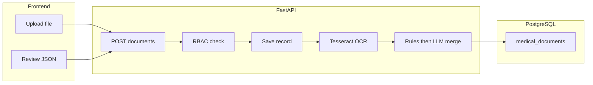

# Documents OCR and Understanding System (Care Circle)

## Context

- Care Circle UI is currently static mock data in `[frontend/app/dashboard/care-circle/page.tsx](frontend/app/dashboard/care-circle/page.tsx)`; there is **no** document API or storage in the backend yet.
- `[backend/requirements.txt](backend/requirements.txt)` already includes `python-multipart` for file uploads; `[backend/Dockerfile](backend/Dockerfile)` does **not** yet ship OCR system dependencies (Tesseract, Poppler).

## Target behavior

- **Users run OCR after deploy** via your app: upload image or PDF from Care Circle; backend returns **raw OCR text** + **structured JSON** aligned with your schema (patient block, clinical measurements, prescription `medications[]`, metadata including `document_type` heuristics).
- **OCR (no LLM):** **Tesseract** (`pytesseract`) for text, **Poppler + pdf2image** for PDF rasterization, **Pillow** for image normalization.
- **Rule pass (deterministic):** regex + keyword windows + BP `NNN/NN`, medication heuristics, `document_type` rules. Missing fields → `null` / `[]`.
- **LLM refinement (in scope for v1):** always runs **after** the rule pass on the **same OCR text** (plus structured hints: rule JSON). Purpose: recover fields rules miss (messy layouts, narrative reports, odd Rx wording). **Not** used for OCR.

**Pipeline:** `Tesseract → normalize text → rule JSON → LLM refinement → validated merged JSON → persist`.

**Safeguards:** Pydantic/schema validation on output; **conservative merge**—LLM output may only **add or clarify** fields that can be **grounded in the OCR substring** (implement via: prompt instructing “quote evidence spans”, post-check that string values are substrings of `raw_ocr_text` or normalized variants, else discard LLM value and keep rule/null); never trust LLM for numeric clinical values unless substring matches OCR.

**Provider choice:** `LLM_PROVIDER` = `groq` | `ollama` (implement both; pick per deployment via env).

- **Groq:** `GROQ_API_KEY`, `GROQ_MODEL`; fast, simple HTTP; verify **PHI / BAA / DPA** fit for production.
- **Ollama:** `OLLAMA_BASE_URL`, `OLLAMA_MODEL`; self-hosted; stronger data residency if the box is yours.

**Degraded behavior (dev / misconfiguration):** if LLM call fails or env incomplete, persist **rule-only** `extracted_json`, set e.g. `llm_refinement_status=skipped|failed`, log error—do not block upload. Production deploy should require valid LLM config per your policy.

## Backend design

### 1. Data model

- New SQLAlchemy model e.g. `MedicalDocument` in `[backend/app/models/](backend/app/models/)` with (minimum):
  - `id` (UUID), `patient_id` (FK patients), `uploaded_by_user_id` (FK users), `original_filename`, `mime_type`, `storage_path` or opaque key, `raw_ocr_text` (text), `extracted_json` (JSONB, **final merged** output), optional `extracted_json_rules` (JSONB) for audit/debug of rule-only pass, `llm_provider_used` (nullable string), `llm_refinement_status` (`ok` / `skipped` / `failed`), `document_type_detected` (string), `processing_status` (`pending` / `completed` / `failed`), `error_message` (nullable), timestamps.
- Alembic: new revision (prefer real `op.create_table` migration rather than only `create_all` if you want production-grade history) or extend `[backend/alembic/versions/20260413_0001_initial_schema.py](backend/alembic/versions/20260413_0001_initial_schema.py)` pattern — **new file** `0002_medical_documents.py` is cleaner.

### 2. OCR service layer

- New package e.g. `[backend/app/services/document_ocr/](backend/app/services/document_ocr/)` (or `app/services/documents/`):
  - `**ingest_file`**: validate MIME (`image/jpeg`, `image/png`, `application/pdf`), size limit (env-configurable, e.g. 10 MB).
  - `**run_ocr**`: PDF → images via `pdf2image`; images → grayscale/contrast optional via Pillow; `pytesseract.image_to_string` / `image_to_data` for confidence if needed.
  - `**normalize_ocr_text**`: light cleanup (merge broken lines, fix common OCR typos for medical tokens you care about, e.g. `G1ucose` → `glucose` in a **whitelist** map only — avoid open-ended “fix everything”).
- New **rule-based extractor** module (e.g. `extraction_rules.py`) implementing your JSON output shape:
  - Dates: regex + `dateutil` or strict parsing → ISO `YYYY-MM-DD` or `null`.
  - BP: `\b(\d{2,3})\s*/\s*(\d{2,3})\b`.
  - Labs: patterns for glucose, HbA1c, cholesterol, insulin with **separate unit capture**; numbers stripped of units per your rules.
  - Prescriptions: line-oriented heuristics (`Rx`, drug name + dose + frequency keywords); output `medications[]` with `name`, `dosage`, `frequency`, `duration`, `route` as strings or `null`.
  - `document_type`: priority rules you specified (prescription vs lab vs narrative fallback `medical_report` / `unknown`).
- **LLM refinement module** (e.g. `llm_refinement.py`): build prompt with full OCR text + rule JSON; call **Groq** OpenAI-compatible chat API or **Ollama** `/api/chat`; parse JSON response; **merge** with rules (prefer non-null rule values where both exist unless LLM cites correction from OCR); run **substring grounding checks** on LLM-filled scalars; validate with shared Pydantic model. Timeouts and token limits in config.

### 3. API (RBAC)

- New router e.g. `[backend/app/api/v1/documents.py](backend/app/api/v1/documents.py)` mounted under `/api/v1` with prefix `/documents` (or `/care-circle/documents` if you prefer URL symmetry with the feature).
- Use existing access patterns from `[backend/app/services/access.py](backend/app/services/access.py)`:
  - **Patient**: upload and list **own** documents (`patient_id == current_user.id`).
  - **Doctor**: upload/list for **assigned** patients; optional **approve** or **merge-to-profile** later (out of scope unless you want it in v1).
  - **Caregiver**: **read-only** or upload-for-linked-patient — **decide one policy** (recommend: **linked caregivers can upload on behalf of patient** only if product allows; otherwise read-only list + view extraction).
- Endpoints (v1):
  - `POST /documents` — `multipart/form-data`: `file`, `patient_id`; returns document metadata + `extracted_json` (or 202 + poll if you async later).
  - `GET /documents` — paginated, filtered by `patient_id` (enforced by role).
  - `GET /documents/{id}` — detail including `raw_ocr_text` and JSON (consider **excluding raw text** for caregivers if privacy policy requires summary-only).

### 4. File storage (deployable, free)

- **v1 default**: local filesystem under e.g. `MEDIA_ROOT` / `uploads/{patient_id}/{doc_id}` with unique filenames; path stored in DB. Document in README: for multi-instance deployments, move to **S3-compatible** or **Supabase Storage** in a follow-up.
- Ensure `**.gitignore`** already ignores upload dir; add env `UPLOAD_DIR`.

### 5. Dependencies and Docker

- Extend `[backend/requirements.txt](backend/requirements.txt)`: `pytesseract`, `pdf2image`, `Pillow`, `python-dateutil` (if not present); `httpx` already present for Groq/Ollama HTTP.
- Extend `[backend/Dockerfile](backend/Dockerfile)` `apt-get` install: `tesseract-ocr`, `tesseract-ocr-eng` (add `fra`/`ara` later if needed), `poppler-utils`.
- Document **Windows dev**: install Tesseract binary + Poppler and set `pytesseract.pytesseract.tesseract_cmd` via env in config.

### 6. Configuration

- Add to `[backend/app/core/config.py](backend/app/core/config.py)`: `UPLOAD_MAX_MB`, `UPLOAD_DIR`, optional `TESSERACT_CMD`.
- **LLM refinement (required feature; provider selectable):**
  - `LLM_PROVIDER`: `groq` | `ollama`
  - **Groq:** `GROQ_API_KEY`, `GROQ_MODEL`, base URL constant or env override per Groq OpenAI-compatible docs.
  - 
  - **Shared:** `LLM_TIMEOUT_SECONDS`, `LLM_MAX_OCR_CHARS` (truncate tail with marker if needed to fit context).
- Update `[backend/.env.example](backend/.env.example)` with the above and PHI/compliance note for Groq vs self-hosted Ollama.

## Frontend design

- Add a **“Medical documents”** card/section on `[frontend/app/dashboard/care-circle/page.tsx](frontend/app/dashboard/care-circle/page.tsx)` (or a child component under `components/care-circle/`):
  - File input + upload to `POST /api/v1/documents` with Bearer token (reuse future auth client; until wired, use env `NEXT_PUBLIC_API_URL` + fetch).
  - Show **processing state**, then render extracted fields in a read-only form (tables for labs, list for medications) with explicit “values from OCR — verify with clinician” disclaimer.
  - List recent uploads (from `GET /documents`).

## Security and compliance (minimal v1)

- Virus scanning: out of scope; at minimum **content-type + extension checks** and size limits.
- **PHI**: encrypt at rest if using cloud storage later; for disk, restrict server permissions.
- Audit: store `uploaded_by_user_id` and timestamps; log document id + user id on access (structured log line).

## Testing

- **Unit tests**: rule extractor fixtures; **LLM merge** tests with **mocked** HTTP responses (no real Groq/Ollama in CI) covering merge + substring grounding rejection.
- **Integration test** (optional): Docker with Tesseract + fake Ollama or recorded Groq stub.

## Suggested implementation order

1. Model + migration (include `extracted_json_rules`, `llm_refinement_status`, `llm_provider_used`) + config + upload storage helper.
2. OCR pipeline + rule extractor + **LLM refinement** (Groq + Ollama) + merge/validate + persistence of final + rule snapshots.
3. `POST/GET` documents API + RBAC.
4. Care Circle UI upload + results display (show final JSON; optional “rule vs refined” toggle if you expose `extracted_json_rules`).
5. Dockerfile/README: Tesseract/Poppler + document LLM env for Groq vs Ollama.

