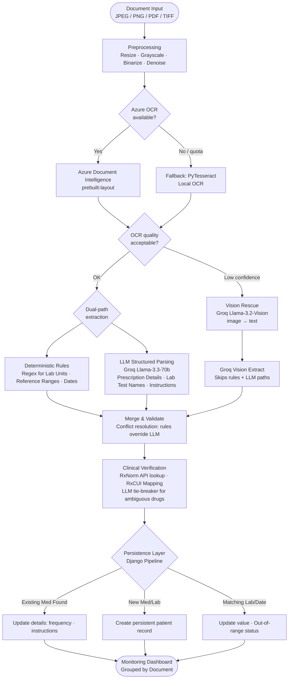

# Glunova AI Platform - OCR & Extraction Module
**Current Architecture and Implementation Guide (Code-Aligned)**

*Innova Team • ESPRIT • Class 3IA3 • 2026*

---

## Executive Summary

The **OCR & Extraction Module** in Glunova is a specialized, multi-layered service designed to process clinical documents and transform them into verified, longitudinal patient data. It is implemented in `backend/fastapi_ai/extraction/`.

The pipeline employs a **hybrid architecture** that has been strictly optimized for two primary document classes: **Prescriptions** and **Lab Reports**. It combines state-of-the-art cloud OCR, deterministic rule-based engines, LLM-based structured extraction, and clinical database verification (RxNorm).

### Key Capabilities
- **Specialized Classification**: Binary classification (Prescription vs. Lab Report) ensures high-fidelity extraction without the overhead of generic "vitals" logic.
- **Adaptive OCR Engine**: Prioritizes Azure Document Intelligence with automatic fallback to local Tesseract OCR.
- **Multimodal LLM Rescue**: Uses Vision-Language Models (Groq Llama-3.2-Vision) if standard OCR yields low-quality text.
- **Longitudinal Persistence**: "Update vs. Create" logic (Upsert) ensures that scanned documents update existing medication regimens and lab trends instead of creating duplicates.
- **Clinical Verification**: Automated lookup via National Library of Medicine (RxNorm) with support for qualitative *Instructions* and *Out-of-range* lab flagging.

---

## Architecture Flow

The pipeline orchestrator (`orchestrator.py`) handles documents through 6 sequential phases:

---
## Module Breakdown

### 1. Preprocessing (`preprocessing.py`)
- Standardizes incoming file formats and normalizes resolution for optimal OCR performance.

### 2. OCR Strategy (`azure_ocr.py` & `local_ocr.py`)
- **Azure Engine**: Primary choice, utilizing `prebuilt-layout` for structural accuracy.
- **Fallback Engine**: Local Tesseract ensures offline/low-cost availability.
- **Vision Rescue**: If OCR fails, a multimodal Llama model interprets the image directly.

### 3. Dual-Path Extraction
The pipeline splits into deterministic and probabilistic workflows:

#### A. Deterministic Rules (`extraction_rules.py`)
- Focused on high-precision numerical values: *Lab units, Reference ranges, and Document dates*.
- Serves as the grounded "source of truth" to prevent LLM hallucinations on lab values.

#### B. LLM Structured Parsing (`groq_extract.py`)
- Uses Groq (Llama-3.3-70b) to extract complex text fields: *Medication name, instructions (directions), lab test names*.
- Specifically trained (via few-shot prompts) to capture medication directions (e.g., *"Take after meals"*) as qualitative strings.

### 4. Clinical Verification (`medication_verify.py`)
- All medications are verified against **RxNorm**.
- Generates `RxCUI` and `name_display` for standardized medical records.
- Flags medications as **Matched**, **Ambiguous**, or **Unverified** for doctor review.

### 5. Smart Persistence (`pipeline.py` - Django)
- **Medication De-duplication**: Uses (RxCUI, Name, Dosage) to identify existing medications. If found, it updates the `frequency` and `instructions` instead of adding a new row.
- **Lab Trend Matching**: Uses (Normalized Name, Date, Unit) to identify existing lab results, updating the `value` and `is_out_of_range` status.

### 6. UI Representation
- **Grouped Visualization**: Lab results are displayed in an **Accordion** format, grouped by the original scanned document for clinical context.
- **Medication Tracking**: Historical medications show their extracted directions (Instructions) and RxNorm metadata.

---

## Observability & Evaluation (`evaluation/`)

The module includes an offline evaluation harness using **DeepEval** (GEval metrics) to grade:
- **OCR Fidelity**: Verification of raw text accuracy.
- **Schema Mapping**: Accuracy of the Prescription/Lab classification.
- **Instructions Accuracy**: Fidelity of qualitative direction extraction.
- **Document Type Accuracy**: Success rate of the binary document classifier.
