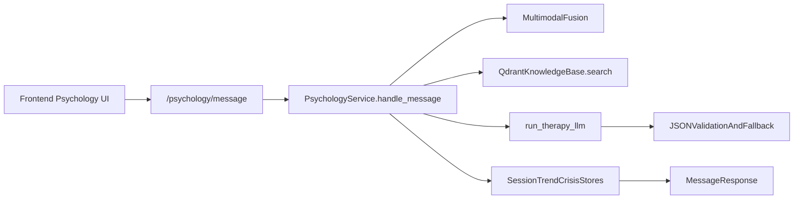

# Glunova AI Platform - Psychology Module
**Current Architecture and Implementation Guide (Code-Aligned)**

*Innova Team • ESPRIT • Class 3IA3 • 2026*

---

## Executive Summary

**Sanadi (سنَدي)** is Glunova's multimodal psychology assistant for diabetic patients.  
It runs as a FastAPI-based AI service with:

- real-time emotion inference (face, speech, text),
- deterministic distress fusion + mental-state classification,
- CBT-oriented RAG + LLM response generation,
- crisis safety gating and physician-review control,
- session, trend, and crisis observability endpoints,
- offline evaluation harness (RAGAS + DeepEval, Gemini/OpenAI capable).

This document reflects what is currently implemented in `backend/fastapi_ai/psychology/`.

---

## 1) Runtime Architecture

| Layer | Main Pieces |
|---|---|
| Frontend | Psychology dashboard/chat UI (Next.js app) |
| API Gateway | FastAPI routes in `psychology/router.py` |
| Core Service | `PsychologyService` orchestration in `psychology/service.py` |
| Knowledge/RAG | `QdrantKnowledgeBase` in `psychology/knowledge_ingestion.py` |
| Persistence | PostgreSQL stores via `psychology/repositories.py` + in-memory fallback |
| Safety | crisis probability + triggers + crisis event logging and gate clearing |

### Request Path



---

## 2) Input Modalities and Fallback Behavior

The message pipeline accepts optional camera/audio signals and always processes text:

- `text` is logically required (or auto-filled from `speech_transcript`).
- `face_frame_base64` is optional.
- `speech_audio_base64` is optional.
- fallback to cached face evidence if the latest frame fails.
- if all optional modalities are absent, text-only still works.

This is implemented in `_fusion()` and request validation in `psychology/schemas.py`.

---

## 3) Emotion + Mental State Stack

### 3.1 Emotion Inference

| Face | `dima806/facial_emotions_image_detection` (HF Image Classifier) | Chosen for its small footprint (~86M params) and high accuracy on the 7 basic emotions, avoiding massive multi-GB downloads during development while providing reliable real-time inference. |
| Speech | `iic/emotion2vec_plus_large` (ModelScope Pipeline) | A state-of-the-art self-supervised model for speech emotion recognition. It provides robust feature extraction regardless of the spoken language, essential for supporting Arabic/Darija alongside English/French. |
| Text | `j-hartmann/emotion-english-distilroberta-base` (Optional HF) | A lightweight and high-performing model for English text emotion. However, the system defaults to keyword-based heuristics to ensure near-zero latency and avoid cold-start delays. |
| Embedding | `all-MiniLM-L6-v2` (SentenceTransformers) | Chosen for its extreme efficiency (80MB) and high performance in semantic retrieval, powering the Qdrant knowledge base without significant compute overhead. |

### 3.2 Fusion Output Schema

```json
{
  "label": "anxious",
  "distress_score": 0.42,
  "confidence": 0.78,
  "stress_level": 4,
  "sentiment_score": -0.4,
  "modalities_used": ["text", "face"]
}
```

### 3.3 Mental State Classification

Mental-state classification is deterministic (not a separately trained classifier):

- crisis => `Crisis`,
- else thresholds on distress score (+ trend slope adjustment):
  - `>= 0.80`: `Depressed`
  - `>= 0.60`: `Distressed`
  - `>= 0.35`: `Anxious`
  - else `Neutral`

---

## 4) Therapy Generation (RAG + LLM)

The therapy turn is orchestrated in `_therapy_reply_multimodal()`:

1. Retrieve KB snippets from Qdrant (`limit=5`).
2. Compute retrieval quality (`ok`, `low_score`, `empty`).
3. Build contextual prompt: user text + language + fusion summary + memory + health context + KB snippets.
4. Call `run_therapy_llm()` (Groq).
5. Validate strict JSON response.
6. If invalid/unavailable: deterministic fallback templates.

### LLM Choice and Rationale

- **Primary Model**: `llama-3.3-70b-versatile` (via Groq).
- **Why Llama vs. GPT-4/Claude Sonnet/Opus**:
    1. **Inference Latency (The "Groq Advantage")**: For a psychology assistant, real-time response is critical for maintaining patient rapport. Llama on Groq delivers sub-second Token-Per-Second (TPS) speeds that far exceed the latency of GPT-4 or Claude 3 Opus, which can have significant "thinking" delays.
    2. **Cost-Efficiency**: Llama 3.3 70B provides GPT-4 class reasoning at a fraction of the cost per million tokens, allowing the platform to scale to more patients without prohibitive API overhead.
    3. **Data Sovereignty & Future-Proofing**: Since Llama is an open-weights model, Glunova retains a clear path to **self-hosting (On-Premise)** for strict medical data privacy (HIPAA compliance) in the future. GPT and Claude are closed-source and lock the platform into a third-party vendor's infrastructure.
    4. **Empathetic Nuance**: In benchmarks and internal testing, Llama 3 exhibits a highly conversational and empathetic "personality" suitable for CBT-informed coaching, whereas some closed models can feel overly "robotic" or over-refusal prone in mental health contexts.
- **Vision Model**: `llama-3.2-11b-vision-preview` (via Groq).
- **Why**: Used for multimodal context where visual analysis of a patient's state or environment is required, providing a compact but capable vision-language bridge.

### LLM Provider (current code)

- Groq Chat Completions client for ultra-low latency.
- safety-oriented system prompt (no diagnosis/no prescribing, multilingual handling, escalation instruction).

### LLM Internal Response Contract

```json
{
  "reply": "string",
  "technique": "string",
  "recommendation": "string|null",
  "citations": ["chunk_id_or_source"],
  "safety_mode": "normal|low_context|elevated_guard|crisis_guard"
}
```

### External API Response Schema (`/psychology/message`)

```json
{
  "session_id": "uuid",
  "reply": "string",
  "emotion": "neutral|happy|anxious|distressed|depressed",
  "distress_score": 0.42,
  "language_detected": "en|fr|ar|darija|mixed",
  "technique_used": "string",
  "recommendation": "string|null",
  "crisis_detected": false,
  "mental_state": "Neutral|Anxious|Distressed|Depressed|Crisis",
  "fusion": {},
  "physician_review_required": false,
  "anomaly_flags": [],
  "retrieval_quality": "ok|low_score|empty"
}
```

---

## 5) Retrieval and Knowledge Base

### 5.1 Storage

- Qdrant collection for CBT/psychology knowledge.
- embeddings via a SentenceTransformers model from settings.
- ingestion from manifest + local PDF sources.

### 5.2 Retrieval Pipeline

- vector recall (`RECALL_LIMIT` candidates from Qdrant),
- **mandatory hybrid rerank** (vector + lexical overlap + category priority boosts),
- dedupe + final top-k,
- retrieval quality gate used by response logic.

Current rerank scoring implementation (code-aligned):

- `0.72 * vector_score`
- `0.22 * lexical_overlap(query_tokens, doc_tokens)`
- `+ category_priority(category)`

This means Sanadi never uses raw vector hits directly in final prompt assembly; results are always passed through hybrid reranking first.

### 5.3 Retrieval Health & Ops Endpoints

- `GET /psychology/knowledge/search`
- `GET /psychology/knowledge/sources`
- `POST /psychology/knowledge/reindex`
- `GET /psychology/rag/health`

---

## 6) Safety and Crisis Controls

Current crisis logic is rule/probability-based within the service flow (not an external fine-tuned crisis model in this code path):

- crisis probability from text,
- trigger by threshold/history,
- crisis event recording,
- safe static crisis response (`SAFE_CRISIS_REPLY`),
- recommendation forced to `notify_clinician_immediately`,
- physician-review gate support:
  - block new session if gate is active,
  - `POST /psychology/physician/clear-gate` to clear.

### 6.1 Runtime Anomaly Detection (Enabled by Default)

Sanadi returns anomaly telemetry on each `/psychology/message` response through:

- `retrieval_quality`: `ok | low_score | empty`
- `anomaly_flags`: list of runtime flags

Current anomaly families:

- retrieval anomalies: `retrieval_low_score`, `retrieval_empty`
- generation anomalies: `llm_parse_fallback`, `llm_missing_citations`, `llm_low_context_fallback`, `llm_elevated_guard_mode`, `llm_crisis_guard_mode`
- safety trend anomalies: `safety_elevated`, `fusion_abrupt_jump`

These flags are logged and returned to the caller so monitoring and doctor-facing layers can detect degraded retrieval or unstable generation behavior.

---

## 7) Session, Trends, and Storage

`PsychologyService` supports both:

- PostgreSQL-backed stores (if a DB pool exists),
- in-memory fallback stores.

Primary runtime entities:

- sessions + messages,
- crisis events,
- trend points (`distress_score` over time),
- memory retrieval/injection.

Core endpoints:

- `POST /psychology/session/start`
- `POST /psychology/message`
- `POST /psychology/session/end`
- `GET /psychology/session/{session_id}`
- `GET /psychology/trends/{patient_id}`
- `GET /psychology/crisis/events`
- `POST /psychology/crisis/ack`

Real-time camera stream:

- `WS /psychology/ws/emotion/{patient_id}`

---

## 8) API Schemas (Request Examples)

### 8.1 Start Session

```json
{
  "patient_id": 123,
  "preferred_language": "en"
}
```

### 8.2 Message

```json
{
  "session_id": "uuid",
  "patient_id": 123,
  "text": "I feel overwhelmed today",
  "face_frame_base64": null,
  "speech_audio_base64": null,
  "speech_transcript": null
}
```

### 8.3 Emotion Frame

```json
{
  "patient_id": 123,
  "frame_base64": "data:image/jpeg;base64,..."
}
```

---

## 9) Evaluation Architecture (Current)

Offline evaluation package: `backend/fastapi_ai/psychology/evaluation/`

### Current evaluators

- **RAGAS** for retrieval/grounding metrics
- **DeepEval** for answer relevancy/safety scoring

### Key behavior

- evaluator keys loaded from `backend/.env`,
- Gemini key (`GOOGLE_API_KEY` / `GEMINI_API_KEY`) supported for both RAGAS and DeepEval,
- OpenAI optional fallback path,
- lexical fallback path remains for resilience when provider/configuration fails,
- report outputs:
  - `backend/fastapi_ai/tmp/sanadi_eval_reports/<run_id>.json`
  - `backend/fastapi_ai/tmp/sanadi_eval_reports/<run_id>.md`

---

## 10) Known Operational Notes

- First-run model downloads may happen for HF models if cache is cold.
- Gemini free-tier quotas can throttle evaluator LLM calls (429), which can degrade RAGAS score quality.
- For stable eval baselines, use a quota-ready API key and run at low frequency/batch size.

---

## 11) Technology Stack (Code-Aligned Snapshot)

| Area | Model / Implementation | Rationale |
|---|---|---|
| API server | FastAPI | High performance, async-first, and native JSON support. |
| Orchestration | `PsychologyService` | Centralized logic for fusion, RAG, and safety gating. |
| Therapy LLM | `llama-3.3-70b-versatile` (Groq) | Frontier reasoning + sub-second latency via Groq. |
| Vision LLM | `llama-3.2-11b-vision-preview` (Groq) | Efficient visual understanding. |
| Face emotion | `dima806/...facial_emotions...` | Lightweight (~86MB) but accurate real-time inference. |
| Speech emotion | `emotion2vec_plus_large` | Robust, language-agnostic audio feature extraction. |
| Text emotion | Heuristic + DistilRoBERTa | Optimized for latency (heuristics) with optional deep analysis. |
| Embeddings | `all-MiniLM-L6-v2` | Fast, compact, and high-quality semantic vectors. |
| Vector DB | Qdrant | Scalable, high-performance vector search with hybrid filtering. |
| Evaluation | RAGAS + DeepEval | Rigorous multimodal/LLM-based quality metrics (using Gemini/OpenAI). |

---

*Confidential - Glunova AI Platform - Psychology Module Architecture (Current Implementation)*
