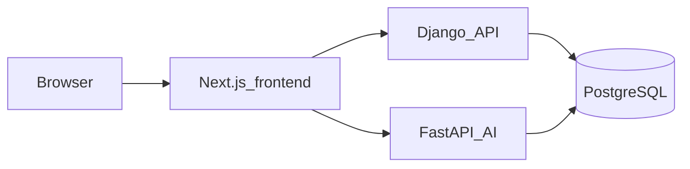

# Glunova

AI-assisted diabetes care platform: non-invasive screening, monitoring, nutrition and activity, psychology, kids engagement, care circle, clinic decision support, and accessible care. See [functionnalities_context.md](functionnalities_context.md) for the full feature matrix and team assignments.

**Innova Team · ESPRIT · Class 3IA3 · 2026**

## Architecture (high level)



Django owns identity, RBAC, and relational data; FastAPI serves AI-heavy paths. Both use the same PostgreSQL database. Details: [backend/ARCHITECTURE.md](backend/ARCHITECTURE.md).

## Repository layout

| Path | Role |
|------|------|
| [frontend/](frontend/) | Next.js 16, React 19, TypeScript, Tailwind ([package.json](frontend/package.json)) |
| [backend/django_app/](backend/django_app/) | Auth, RBAC, migrations, REST APIs, document metadata and orchestration |
| [backend/fastapi_ai/](backend/fastapi_ai/) | OCR/extraction, screening inference, AI routes; OpenAPI at `/docs` |
| [docker-compose.yml](docker-compose.yml) | `django_app` → port **8000**, `fastapi_ai` → port **8001** |
| [Makefile](Makefile) | Docker backend targets (`backend-up`, `backend-down`, etc.) and local Windows backends |
| [scripts/start_backends_local.bat](scripts/start_backends_local.bat) | Local Django + FastAPI (Windows) |

## Prerequisites

- **Backends:** Python 3 with [`uv`](https://github.com/astral-sh/uv) (used by the local script) or compatible pip workflow; PostgreSQL reachable via `DATABASE_URL`.
- **Front end:** Node.js 22+ and [pnpm](https://pnpm.io/).
- **Docker (optional):** Docker Compose, if you run backends in containers instead of locally.

## Environment variables

Create **`backend/.env`** before starting backends (Docker or local). At minimum, set a PostgreSQL connection string:

- `DATABASE_URL` — required (e.g. Supabase or local Postgres). See [backend/README.md](backend/README.md).

Optional **frontend** overrides (defaults use the same host as the page on ports 8000 / 8001 — see [frontend/lib/auth.ts](frontend/lib/auth.ts)):

- `NEXT_PUBLIC_DJANGO_API_URL`
- `NEXT_PUBLIC_FASTAPI_API_URL`

## How to run

### Backends

From the repository root:

```bash
make backend-local
```

This runs [scripts/start_backends_local.bat](scripts/start_backends_local.bat) (installs backend deps with `uv`, runs migrations, starts Django on **8000** and FastAPI on **8001** in separate windows). Requires `backend/.env` and a Windows environment with `make` and the script available.

**Docker alternative:** `docker compose up --build` from the repo root, or `make backend-up` / `make backend-rebuild` — see [Makefile](Makefile) and [backend/README.md](backend/README.md).

### Frontend

```bash
cd frontend
pnpm install
pnpm dev
```

Run the backends first so authentication and API calls work end to end.

## Service URLs

| Service | URL |
|---------|-----|
| Django API | http://localhost:8000 |
| FastAPI | http://localhost:8001 |
| FastAPI OpenAPI | http://localhost:8001/docs |

## Further reading

- [functionnalities_context.md](functionnalities_context.md) — objectives, platform axes, and feature ownership.
- [backend/ARCHITECTURE.md](backend/ARCHITECTURE.md) — JWT auth, RBAC, documents OCR pipeline, screening models.
- [backend/README.md](backend/README.md) — hybrid backend overview and Docker-focused run notes.
