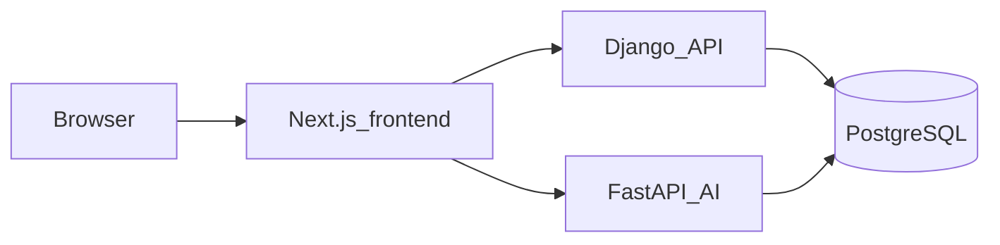

<p align="center">
  
</p>

<h1 align="center">Glunova</h1>

<p align="center">
  <strong>AI-assisted diabetes care platform</strong> — non-invasive screening, monitoring, nutrition, psychology, care coordination, medical document OCR, and clinical decision support.
</p>

<p align="center">
  <a href="https://esprit.tn/"></a>
  <a href="https://nextjs.org/"></a>
  <a href="https://react.dev/"></a>
  <a href="https://www.typescriptlang.org/"></a>
  <a href="https://www.djangoproject.com/"></a>
  <a href="https://fastapi.tiangolo.com/"></a>
  <a href="https://www.postgresql.org/"></a>
</p>

---

## Overview

**Glunova** is a full-stack health technology project focused on **diabetes care**, **machine learning–assisted screening**, and **patient-centered digital health**. It combines a modern **React** and **Next.js** frontend with a **hybrid Python backend** (**Django** REST APIs and **FastAPI** for AI-heavy workloads), backed by **PostgreSQL**. The platform supports **API-driven** workflows, **medical document processing** and **OCR**, **nutrition automation** (including vision-based food analysis), and **role-based access control (RBAC)** for secure multi-user care scenarios.

This project was developed as part of coursework at **Esprit School of Engineering** (Class **3IA3**, **Innova Team**, **2026**). It demonstrates applied skills in **full-stack development**, **API design**, **AI integration**, and **health informatics**.

For a detailed feature matrix and team ownership, see [features.md](features.md).

---

## Features

- **Non-invasive screening** — multimodal signals (e.g. voice, tongue, eye) and fusion pipelines for risk insight without routine blood tests where the stack supports it.
- **Monitoring and alerts** — longitudinal history, risk tiers, health alerts, and progression-oriented views.
- **Nutrition and activity** — glycemic-index–aware meal planning, exercise scheduling, and agentic nutrition guidance; ingredient and portion cues via **computer vision** (e.g. **YOLO-World** / **Ultralytics** in the nutrition pipeline).
- **Psychology and engagement** — multimodal emotional support, therapeutic modes, pediatric engagement, and accessible UX patterns.
- **Care circle and clinic** — family and caregiver coordination, **medical document OCR** and extraction orchestration, and clinical decision support surfaces.
- **Security and governance** — **JWT** authentication, **RBAC**, and shared relational data between services (see [role_access_plan.md](role_access_plan.md) and [rbac_implementation_plan.md](rbac_implementation_plan.md)).

---

## Tech Stack

### Frontend

- **Next.js** (App Router), **React 19**, **TypeScript**
- **Tailwind CSS** and **Radix UI** primitives (see [frontend/package.json](frontend/package.json))
- **pnpm** for package management

### Backend

- **Django** — authentication, **RBAC**, migrations, REST APIs, document metadata and orchestration ([backend/django_app/](backend/django_app/))
- **FastAPI** — OCR and extraction, screening inference, AI routes; **OpenAPI** documentation at `/docs` ([backend/fastapi_ai/](backend/fastapi_ai/))
- **PostgreSQL** — shared database for Django and FastAPI
- **PyTorch** and **Ultralytics YOLO-World** — model-backed screening and nutrition vision paths (see [backend/ARCHITECTURE.md](backend/ARCHITECTURE.md))

### Other tools

- **Docker** and **Docker Compose** for containerized backends ([docker-compose.yml](docker-compose.yml))
- **GNU Make** and [Makefile](Makefile) for repeatable backend lifecycle commands
- **`uv`** (Python) for fast local dependency installs in the provided Windows script
- **Node.js 22+** for the frontend toolchain

---

## Directory structure

| Path | Role |
|------|------|
| [frontend/](frontend/) | Next.js app, UI, client integration with Django and FastAPI |
| [backend/django_app/](backend/django_app/) | Auth, RBAC, REST, migrations |
| [backend/fastapi_ai/](backend/fastapi_ai/) | AI and OCR routes, FastAPI OpenAPI |
| [docker-compose.yml](docker-compose.yml) | Compose stack (`django_app` → **8000**, `fastapi_ai` → **8001**) |
| [Makefile](Makefile) | `backend-up`, `backend-down`, local backend helpers |
| [scripts/start_backends_local.bat](scripts/start_backends_local.bat) | Local Django + FastAPI on Windows |

---

## Getting started

### Prerequisites

- **Python 3** with [`uv`](https://github.com/astral-sh/uv) (recommended by the local script) or an equivalent **pip** workflow
- **PostgreSQL** reachable via **`DATABASE_URL`**
- **Node.js 22+** and [pnpm](https://pnpm.io/) (`npm install -g pnpm`)
- **Docker** (optional) for Compose-based backends
- **GNU Make** (optional); on Windows you can use `choco install make` or run the underlying **Docker** / **batch** commands directly

### Environment variables

Create **`backend/.env`** before starting backends. At minimum:

- **`DATABASE_URL`** — required (e.g. local Postgres or managed hosting). Details: [backend/README.md](backend/README.md).

Optional **frontend** overrides (defaults follow the current host on ports **8000** / **8001**; see [frontend/lib/auth.ts](frontend/lib/auth.ts)):

- `NEXT_PUBLIC_DJANGO_API_URL`
- `NEXT_PUBLIC_FASTAPI_API_URL`

### Backend setup

From the repository root (Windows, with `make`):

```bash
make backend-local
```

This runs [scripts/start_backends_local.bat](scripts/start_backends_local.bat): creates **`.venv`** if needed, installs dependencies with **`uv`**, runs migrations, then starts **Django** on **8000** and **FastAPI** on **8001**. Requires **`backend/.env`**. You may run the **`.bat`** file directly without **Make**.

**Docker:** from the repo root:

```bash
docker compose up --build
```

or use `make backend-up` / `make backend-rebuild` as documented in the [Makefile](Makefile) and [backend/README.md](backend/README.md).

### Frontend setup

```bash
cd frontend
pnpm install
pnpm dev
```

Start the **backend** services first so authentication and **API** calls work end-to-end.

### Service URLs

| Service | URL |
|---------|-----|
| Django API | http://localhost:8000 |
| FastAPI | http://localhost:8001 |
| FastAPI OpenAPI | http://localhost:8001/docs |

### Architecture (high level)



Django owns identity, **RBAC**, and relational data; FastAPI serves **AI**- and **OCR**-heavy paths. Both use the same **PostgreSQL** database. Extended design notes: [backend/ARCHITECTURE.md](backend/ARCHITECTURE.md).

### Documentation

- [features.md](features.md) — objectives, platform axes, feature ownership
- [backend/ARCHITECTURE.md](backend/ARCHITECTURE.md) — **JWT**, **RBAC**, documents **OCR** pipeline, screening models
- [backend/README.md](backend/README.md) — hybrid backend and Docker notes
- [role_access_plan.md](role_access_plan.md) — role-based access model
- [rbac_implementation_plan.md](rbac_implementation_plan.md) — **RBAC** implementation plan

---

## Acknowledgments

This project was completed under the supervision of **Mme Jihene Hlel**, **Mr Fedi Baccar**, and **Mme Widad Askri** at **Esprit School of Engineering**, as part of the **Innova Team** (Class **3IA3**, **2026**).

We thank **Esprit School of Engineering** for the academic framework and mentorship that made this **full-stack AI** and **digital health** initiative possible.

---

<p align="center">
  <sub>Glunova · Innova Team · Esprit School of Engineering · 3IA3 · 2026</sub>
</p>
