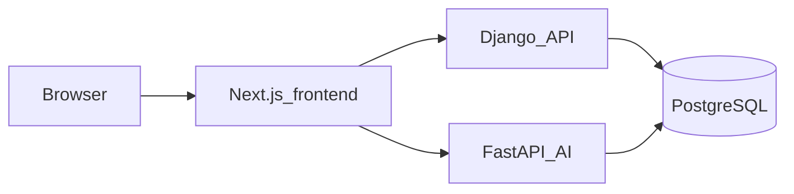

# 🏥 Glunova — AI-Assisted Diabetes Care Platform

[](https://esprit.tn/)
[](https://nextjs.org/)
[](https://react.dev/)
[](https://www.djangoproject.com/)
[](https://fastapi.tiangolo.com/)
[](https://www.postgresql.org/)
[](https://www.typescriptlang.org/)

**Glunova** is an AI-assisted diabetes care platform: non-invasive screening, monitoring, nutrition and activity, psychology, kids engagement, care circle, clinic decision support, and accessible care. For the full feature matrix and team assignments, see [features.md](features.md).

### 🎓 Academic context

Developed by **Innova Team** · **ESPRIT** · **Class 3IA3** · **2026**.

**Supervised by:** Mme Jihene Hlel · Mr Fedi Baccar · Mme Widad Askri

---

## 👥 Innova Team

Feature ownership and full roster: [features.md](features.md)

---

## 🚀 Platform highlights

### 🩺 Non-invasive screening

- Voice, tongue, and eye signals for risk signals without blood tests; fusion and modality-tolerant pipelines where applicable.

### 📊 Monitoring & alerts

- Longitudinal screening history, risk tiers, health alerts, and disease progression tracking.

### 🥗 Nutrition & activity

- GI-aware meal planning, glucose-safe exercise scheduling, and agentic nutrition guidance.

### 🧠 Psychology & engagement

- Multimodal emotion support, therapeutic modes, kids engagement, and accessible UX.

### 🤝 Care circle & clinic

- Family and caregiver coordination, medical document OCR pipeline, and clinical decision support.

---

## 🏗 Architecture (high level)



Django owns identity, RBAC, and relational data; FastAPI serves AI-heavy paths. Both use the same PostgreSQL database. Details: [backend/ARCHITECTURE.md](backend/ARCHITECTURE.md).

---

## 📁 Repository layout

| Path | Role |
|------|------|
| [frontend/](frontend/) | Next.js 16, React 19, TypeScript, Tailwind ([package.json](frontend/package.json)) |
| [backend/django_app/](backend/django_app/) | Auth, RBAC, migrations, REST APIs, document metadata and orchestration |
| [backend/fastapi_ai/](backend/fastapi_ai/) | OCR/extraction, screening inference, AI routes; OpenAPI at `/docs` |
| [docker-compose.yml](docker-compose.yml) | `django_app` → **8000**, `fastapi_ai` → **8001** |
| [Makefile](Makefile) | Docker backend targets (`backend-up`, `backend-down`, …) and local Windows backends |
| [scripts/start_backends_local.bat](scripts/start_backends_local.bat) | Local Django + FastAPI (Windows) |

---

## 🛠 Technologies

### Backend

- **Django** — identity, RBAC, REST, migrations
- **FastAPI** — OCR, screening, AI routes; docs at `/docs`
- **PostgreSQL** — shared database for both services
- **PyTorch** — screening models (e.g. tongue classification); see [backend/ARCHITECTURE.md](backend/ARCHITECTURE.md)

### Frontend

- **Next.js 16** · **React 19** · **TypeScript** · **Tailwind CSS**
- **pnpm** for package management

---

## ⚙️ Installation & usage

### 📋 Prerequisites

- **Backends:** Python 3 with [`uv`](https://github.com/astral-sh/uv) (used by the local script) or a compatible pip workflow; PostgreSQL reachable via `DATABASE_URL`.
- **Frontend:** Node.js **22+** and [pnpm](https://pnpm.io/) (`npm install -g pnpm`).
- **Docker (optional):** Docker Compose for containerized backends.
- **Make (optional):** [Makefile](Makefile) targets need GNU Make on your `PATH`. On Windows: `choco install make` (elevated). If you skip `make`, run the underlying commands (e.g. `scripts\start_backends_local.bat` or `docker compose`).

### 🔐 Environment variables

Create **`backend/.env`** before starting backends (Docker or local). At minimum:

- **`DATABASE_URL`** — required (e.g. Supabase or local Postgres). See [backend/README.md](backend/README.md).

Optional **frontend** overrides (defaults use the same host as the page on ports 8000 / 8001 — see [frontend/lib/auth.ts](frontend/lib/auth.ts)):

- `NEXT_PUBLIC_DJANGO_API_URL`
- `NEXT_PUBLIC_FASTAPI_API_URL`

### 🛠 Setup — backends

From the repository root:

```bash
make backend-local
```

This runs [scripts/start_backends_local.bat](scripts/start_backends_local.bat): creates **`.venv`** in the repo root if missing, installs backend deps with `uv`, runs migrations, then starts Django on **8000** and FastAPI on **8001** in separate windows. Requires `backend/.env`, Windows, and `make`. You can run the `.bat` directly without `make`.

**Docker:** `docker compose up --build` from the repo root, or `make backend-up` / `make backend-rebuild` — see [Makefile](Makefile) and [backend/README.md](backend/README.md).

### 🛠 Setup — frontend

```bash
cd frontend
pnpm install
pnpm dev
```

Start the backends first so authentication and API calls work end to end.

---

### 💡 Service URLs

| Service | URL |
|---------|-----|
| Django API | http://localhost:8000 |
| FastAPI | http://localhost:8001 |
| FastAPI OpenAPI | http://localhost:8001/docs |

---

## 📚 Further reading

- [features.md](features.md) — objectives, platform axes, and feature ownership
- [backend/ARCHITECTURE.md](backend/ARCHITECTURE.md) — JWT auth, RBAC, documents OCR pipeline, screening models
- [backend/README.md](backend/README.md) — hybrid backend overview and Docker-focused notes
- [role_access_plan.md](role_access_plan.md) — recommended role-based access model
- [rbac_implementation_plan.md](rbac_implementation_plan.md) — RBAC implementation plan for the codebase

---

*ESPRIT · Innova Team · 3IA3 · 2026*
