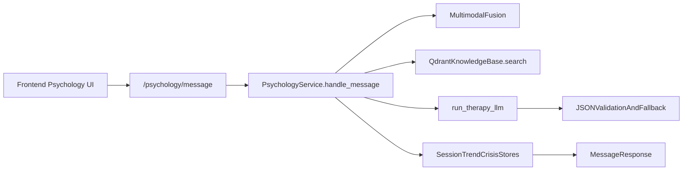

# Glunova AI Platform - Psychology Module
**Current Architecture and Implementation Guide (Code-Aligned)**

*Innova Team • ESPRIT • Class 3IA3 • 2026*

---

## Executive Summary

**Sanadi (سنَدي)** is Glunova's multimodal psychology assistant for diabetic patients.  
It runs as a FastAPI-based AI service with:

- real-time emotion inference (face, speech, text), with HF Inference API or local weights per settings,
- deterministic distress fusion + mental-state classification,
- CBT-oriented RAG (dynamic top‑k, hybrid rerank) + Groq LLM response generation,
- Qdrant episodic memory + optional session-end consolidation into **`semantic_profile_json`**,
- crisis safety gating and physician-review control,
- session, trend, and crisis observability endpoints,
- offline evaluation harness (RAGAS + DeepEval, Gemini/OpenAI capable).

This document reflects what is currently implemented under `backend/fastapi_ai/psychology/` plus the Django ORM definitions in `backend/django_app/psychology/` (tables the FastAPI repositories write to).

---

## 1) Runtime Architecture

| Layer | Main Pieces |
|---|---|
| Frontend | Psychology dashboard/chat UI (Next.js app) |
| API Gateway | FastAPI routes in `psychology/router.py` |
| Core Service | `PsychologyService` in `psychology/service.py`; factory `create_psychology_service()` wires DB-backed or in-memory stores |
| Knowledge/RAG | `QdrantKnowledgeBase` in `psychology/knowledge_ingestion.py`; dynamic `k` via `psychology/kb_retrieval.py` |
| Episodic memory | Qdrant `patient_memory` collection + decay/clinical rerank (`psychology/patient_memory.py`); optional Mem0 spike (`mem0_enabled`, off by default) |
| Session consolidation | End-of-session LLM distill + multi-chunk memory upserts (`psychology/memory_consolidation.py`); model `psychology_consolidation_model` (default `llama-3.1-8b-instant` on Groq) |
| Persistence | PostgreSQL via `psychology/repositories.py` → Django tables (`psychology_*`); in-memory stores if `database_url`/pool unavailable |
| Safety | Crisis probability + triggers + crisis logging + physician-review gate (`physician_review_required` on profile) |

### Request Path



---

## 2) Input Modalities and Fallback Behavior

The message pipeline accepts optional camera/audio signals and always processes text:

- `text` is logically required (or auto-filled from `speech_transcript`).
- `face_frame_base64` is optional.
- `speech_audio_base64` is optional.
- Optional client-provided modality hints (skip server inference when set): `face_emotion` + `face_confidence`, `speech_emotion` + `speech_confidence`.
- Fallback to cached face evidence (recent window, see `PsychologyService._fusion`) when the current frame fails or is omitted.
- If optional modalities are absent, text-only still works.

Implemented in `_fusion()` and `MessageRequest` validators in `psychology/schemas.py`.

### Voice mode endpoints (patient session UI)

Patient voice mode captures audio in the browser, then calls:

- **`POST /psychology/voice/transcribe`** (`multipart/form-data`: field `audio`, optional form `language_hint`) — Groq Whisper (`psychology_voice_stt_model`, default `whisper-large-v3-turbo`); requires **`GROQ_API_KEY`**.
- **`POST /psychology/voice/synthesize`** (JSON `{ "text", "language" }`) — OpenAI **`/v1/audio/speech`** (MP3), model/voice via **`psychology_openai_tts_model`** / **`psychology_openai_tts_voice`**; requires **`OPENAI_API_KEY`**. Use **`psychology_tts_provider=none`** if TTS must be skipped (clients may fall back to Web Speech API).

Voice routes use the same roles as **`POST /psychology/message`**: **patient**, **doctor** (caregiver cannot transcribe/synthesize via API). Max upload: **`psychology_voice_max_upload_bytes`** (default 10 MiB).

---

## 3) Emotion + Mental State Stack

### 3.1 Emotion Inference

Settings live in `core/config.py`. Remote vs local routing is controlled by **`psychology_emotion_inference_mode`**: `auto` | `inference_api` | `local` (`auto` uses HF Inference API when `psychology_hf_api_token` or `HF_TOKEN` / `HUGGINGFACE_HUB_TOKEN` is set, otherwise local checkpoints where implemented).

| Face | `psychology_face_emotion_model` (default **`mo-thecreator/vit-Facial-Expression-Recognition`**) | ViT image classification via HF Inference API when a token is available, else **`transformers`** local weights. Mapped into Sanadi’s five emotion labels in `PsychologyService._map_face_label_generic`. |
| Speech | **`iic/emotion2vec_plus_large`** (ModelScope pipeline, local WAV) | Default path for speech emotion. Optional **`psychology_speech_emotion_hf_model`**: when set and API mode/token allow, **`audio_classification`** on HF Inference API. |
| Text | **`j-hartmann/emotion-english-distilroberta-base`** (optional HF) | If **`psychology_text_emotion_use_hf`** is true, or Inference API token is present in non-`local` mode, HF path runs; otherwise fast keyword heuristics in `_text_emotion()`. |
| Embedding | **`sentence-transformers/all-MiniLM-L6-v2`** (`qdrant_embedding_model`) | Powers Qdrant CBT retrieval and episodic memory vectors; **`qdrant_vector_size`** in settings must match the collection schema in use. |

### 3.2 Multimodal fusion (distress blending)

Server-side fusion is **deterministic**: each active modality contributes a distress proxy; **`PsychologyService._emotion_distribution`** + entropy yields a **`gate_weight`** per modality before averaging into **`distress_score`** (see `_fusion()` in `service.py`).

### 3.3 Fusion Output Schema

```json
{
  "label": "anxious",
  "distress_score": 0.42,
  "confidence": 0.78,
  "stress_level": 4,
  "sentiment_score": -0.4,
  "modalities_used": ["text", "face"]
}
```

### 3.4 Mental State Classification

Mental-state classification is deterministic (not a separately trained classifier):

- **`Crisis`** if **`crisis_detected`** (`_crisis_trigger`: single-turn probability **`>= CRISIS_THRESHOLD` (0.75)** OR last three probabilities average **`>= 0.65`** with current **`>= 0.60`**).
- Else adjust distress: **`adjusted = distress + max(0, trend_slope) * 0.03`** (trend slope from last 7 **`PsychologyEmotionLog`** points), then:
  - `adjusted >= 0.80`: `Depressed`
  - `>= 0.60`: `Distressed`
  - `>= 0.35`: `Anxious`
  - else `Neutral`

---

## 4) Therapy Generation (RAG + LLM)

The therapy turn is orchestrated in `_therapy_reply_multimodal()`:

1. Choose KB depth: **`resolve_kb_retrieval_limit()`** (`psychology/kb_retrieval.py`) from message length + **`MentalState`**, clamped **`psychology_kb_limit_min`** … **`psychology_kb_limit_max`** (defaults **2–8**, base **`psychology_kb_default_limit`** **5**).
2. **`QdrantKnowledgeBase.search()`** pulls **`psychology_kb_recall_limit`** (default **16**) candidates, hybrid-reranks, returns top‑**k**.
3. Retrieval quality **`_retrieval_quality`**: **`empty`** if no chunks; **`low_score`** if the best hybrid **`relevance_score`** is below **`MIN_RETRIEVAL_SCORE`** (**0.16** in `service.py`); otherwise **`ok`**.
4. Build contextual prompt (`llm_therapy.py`): user text + language + fusion summary + **`semantic_profile_compact`** (from Django profile when present) + health JSON + up to **5** episodic memory lines + up to **4** KB snippets (truncated per line).
5. Call **`run_therapy_llm()`** → Groq **`settings.groq_model`** (default **`llama-3.3-70b-versatile`**), **`response_format: json_object`**.
6. Validate strict JSON; on failure use templates or **`llm_low_context_fallback`** when retrieval is weak.

### LLM Choice and Rationale

- **Primary Model**: `llama-3.3-70b-versatile` (Groq **`groq_model`** in `core/config.py`).
- **Why Llama vs. GPT-4/Claude Sonnet/Opus**:
    1. **Inference Latency (The "Groq Advantage")**: For a psychology assistant, real-time response is critical for maintaining patient rapport. Llama on Groq delivers sub-second Token-Per-Second (TPS) speeds that far exceed the latency of GPT-4 or Claude 3 Opus, which can have significant "thinking" delays.
    2. **Cost-Efficiency**: Llama 3.3 70B provides GPT-4 class reasoning at a fraction of the cost per million tokens, allowing the platform to scale to more patients without prohibitive API overhead.
    3. **Data Sovereignty & Future-Proofing**: Since Llama is an open-weights model, Glunova retains a clear path to **self-hosting (On-Premise)** for strict medical data privacy (HIPAA compliance) in the future. GPT and Claude are closed-source and lock the platform into a third-party vendor's infrastructure.
    4. **Empathetic Nuance**: In benchmarks and internal testing, Llama 3 exhibits a highly conversational and empathetic "personality" suitable for CBT-informed coaching, whereas some closed models can feel overly "robotic" or over-refusal prone in mental health contexts.
- **Vision Model**: `llama-3.2-11b-vision-preview` (**`groq_vision_model`**). Used elsewhere in the platform for OCR/vision workloads; Sanadi chat turns use the text chat model above plus optional face-derived signals from **`/psychology/emotion/frame`** and **`_fusion`**, not this vision endpoint in **`llm_therapy.py`**.

### LLM Provider (current code)

- Groq Chat Completions client for ultra-low latency.
- safety-oriented system prompt (no diagnosis/no prescribing, multilingual handling, escalation instruction).

### LLM Internal Response Contract

```json
{
  "reply": "string",
  "technique": "string",
  "recommendation": "string|null",
  "citations": ["chunk_id_or_source"],
  "safety_mode": "normal|low_context|elevated_guard|crisis_guard"
}
```

### External API Response Schema (`/psychology/message`)

```json
{
  "session_id": "uuid",
  "reply": "string",
  "emotion": "neutral|happy|anxious|distressed|depressed",
  "distress_score": 0.42,
  "language_detected": "en|fr|ar|darija|mixed",
  "technique_used": "string",
  "recommendation": "string|null",
  "crisis_detected": false,
  "mental_state": "Neutral|Anxious|Distressed|Depressed|Crisis",
  "fusion": {},
  "physician_review_required": false,
  "anomaly_flags": [],
  "retrieval_quality": "ok|low_score|empty"
}
```

---

## 5) Retrieval and Knowledge Base

### 5.1 Storage

- Qdrant **`qdrant_collection_cbt`** (CBT/psych knowledge) and **`qdrant_collection_memory`** (episodic memory); URLs/keys **`qdrant_url`**, **`qdrant_api_key`**.
- Embeddings via **`qdrant_embedding_model`** (Sentence Transformers naming).
- Ingestion: curated/manifest stubs + **`psychology data/sanadi_knowledge_base.md`** only (section-aligned chunks via **`chunk_sanadi_kb_markdown`** in **`psychology/chunking.py`**). Missing file → manifest stubs only (warning in logs).

### 5.2 Retrieval Pipeline

- Vector recall (**`psychology_kb_recall_limit`**, default **16**) from Qdrant,
- **Hybrid rerank** on every hit list: **`w_vec * vector_score + w_lex * lexical + w_cat * category_norm`**, where **`lexical`** is token‑set overlap (query ∩ doc / |query|), and **`category_norm`** normalizes **`_category_priority(category)`** to **[0, 1]** (see **`QdrantKnowledgeBase._rerank_hits`**),
- Dedupe by stable chunk key + cap by requested **`limit`** (also bounded by **`psychology_kb_final_limit_cap`** in search),

Default weights (**`core/config`**): **`psychology_kb_rerank_vector_weight`** **0.75**, **`psychology_kb_rerank_lexical_weight`** **0.15**, **`psychology_kb_rerank_category_weight`** **0.10**. Override at runtime via JSON file **`psychology_kb_rerank_config_path`** `{"vector", "lexical", "category"}`.

Sanadi does not assemble prompts from raw pre-rerank ordering; hybrid **`relevance_score`** values feed **`_retrieval_quality`** (**`MIN_RETRIEVAL_SCORE`** **0.16**).

### 5.2b Markdown ingestion / reindex

- Source tree: **`psychology/pdf_kb.resolve_psychology_data_dir()`** → env **`psychology_data_dir`** or repo **`psychology data/`**.
- **`QdrantKnowledgeBase.reindex_sources()`** embeds **`sanadi_knowledge_base.md`** when present (UTF-8); read errors propagate. Absent file → upsert manifest stubs only + warning log.
- Chunk payloads carry **`sanadi_topic`** (**`concept`**, **`assessment`**, **`intervention`**, **`referral`**, **`care_system`**, **`lifestyle_communication`**, **`disordered_eating`**, **`assistant_routing`**, **`meta`** for preamble) and **`section_index`** for optional Qdrant filters (payload indexes: **`sanadi_topic`**, **`content_kind`**). Oversized sections use **`pack_markdown_kb_body`** (markdown-native, not **`chunk_pdf_for_kb`**). Preamble chunks are **`content_kind=sanadi_preamble`** with a **`psychology_kb_preamble_rerank_multiplier`** blended-score demotion during hybrid rerank. Tunables: **`psychology_kb_sanadi_max_section_chars`**, **`psychology_kb_sanadi_markdown_pack_chars`** (**`core/config`**).
- **`POST /psychology/knowledge/reindex`** (doctor role).

### 5.3 Retrieval Health & Ops Endpoints

- `GET /psychology/knowledge/search`
- `GET /psychology/knowledge/sources`
- `POST /psychology/knowledge/reindex`
- `GET /psychology/rag/health`

---

## 6) Safety and Crisis Controls

Current crisis logic is rule/probability-based within the service flow (not an external fine-tuned crisis model in this code path):

- crisis probability from text,
- trigger by threshold/history,
- crisis event recording,
- safe static crisis response (`SAFE_CRISIS_REPLY`),
- recommendation forced to `notify_clinician_immediately`,
- physician-review gate support:
  - block new session if gate is active,
  - `POST /psychology/physician/clear-gate` to clear.

### 6.1 Runtime Anomaly Detection (Enabled by Default)

Sanadi returns anomaly telemetry on each `/psychology/message` response through:

- `retrieval_quality`: `ok | low_score | empty`
- `anomaly_flags`: list of runtime flags (the same `retrieval_*` key may appear twice when the LLM path re-appends it alongside other `llm_*` flags—see `handle_message` + `_therapy_reply_multimodal` in `service.py`.)

Current anomaly families:

- Retrieval: **`retrieval_low_score`**, **`retrieval_empty`**
- Generation: **`llm_parse_fallback`**, **`llm_missing_citations`**, **`llm_low_context_fallback`**, **`llm_elevated_guard_mode`**, **`llm_crisis_guard_mode`**
- Safety / fusion: **`safety_elevated`** (**crisis_probability** tier), **`fusion_abrupt_jump`** (patient turn distress delta **≥ 0.45** vs prior fused score)

---

## 7) Session, Trends, Memory, and Storage

`create_psychology_service()` uses **`psychology/db.get_connection_pool()`**:

- With pool: **`PsqlSessionStore`**, **`PsqlCrisisStore`**, **`PsqlTrendStore`**, Django-aligned tables (**`psychology_psychologysession`**, messages, **`psychology_psychologycrisisevent`**, **`psychology_psychologyemotionlog`**, **`psychology_psychologyprofile`**, …).
- Without pool: in-memory **`SessionStore`** / **`CrisisStore`** / **`TrendStore`** (development only).

**Episodic memory** is the Qdrant **`patient_memory`** collection via **`build_memory_store()`** (`patient_memory.py`), with decay/clinical reranking in **`MemoryStore.search_by_message`** implementations (tuned by **`psychology_memory_*`** in `core/config.py`). Session end runs **`run_session_consolidation()`** → optional multi-chunk upserts + **`semantic_profile_json`** on **`PsychologyProfile`**, and may set **`physician_review_required`** from consolidation signals.

Primary runtime entities:

- Sessions + transcript messages (short window trimmed in-memory; persisted in Postgres),
- Crisis events (+ physician gate),
- Trend points (**`PsychologyEmotionLog`** distress / mental_state),
- Qdrant memory vectors + distilled semantic JSON on profile,

### RBAC snapshot (`router.py`)

| Endpoint pattern | Roles |
|---|---|
| **`/session/start`**, **`GET /session/{id}`**, **`GET /trends/{patient_id}`** | **patient**, **doctor**, **caregiver** |
| **`/message`**, **`/emotion/frame`**, **`/voice/*`**, **`/session/end`**, **`WS /ws/emotion/...`** | **patient**, **doctor** |
| **`GET /crisis/events`**, **`POST /crisis/ack`** | **doctor**, **caregiver** (ack: caregiver must supply **`patient_id`**) |
| **`/physician/clear-gate`** | **doctor** |
| **`/knowledge/*`**, **`GET /rag/health`** | **doctor** |

WebSocket **`/psychology/ws/emotion/{patient_id}`**: token via query **`token`** or cookie **`access_token`**; **patient** may only subscribe to their own **`patient_id`**. Inference runs off-thread with **~2.5 s** timeout; server sends at most **~4 fps** (loop sleep).

Core endpoints:

- `POST /psychology/session/start`
- `POST /psychology/message`
- `POST /psychology/session/end`
- `GET /psychology/session/{session_id}`
- `GET /psychology/trends/{patient_id}`
- `GET /psychology/crisis/events`
- `POST /psychology/crisis/ack`

Real-time camera stream:

- `WS /psychology/ws/emotion/{patient_id}`

---

## 8) API Schemas (Request Examples)

### 8.1 Start Session

```json
{
  "patient_id": 123,
  "preferred_language": "en"
}
```

### 8.2 Message

```json
{
  "session_id": "uuid",
  "patient_id": 123,
  "text": "I feel overwhelmed today",
  "face_frame_base64": null,
  "face_emotion": null,
  "face_confidence": null,
  "speech_audio_base64": null,
  "speech_emotion": null,
  "speech_confidence": null,
  "speech_transcript": null
}
```

`text` may be omitted if `speech_transcript` is set (merged in **`MessageRequest`**). Emotion enums: **`neutral` | `happy` | `anxious` | `distressed` | `depressed`**.

### 8.3 Emotion Frame

```json
{
  "patient_id": 123,
  "frame_base64": "data:image/jpeg;base64,..."
}
```

---

## 9) Evaluation Architecture (Current)

Offline evaluation package: `backend/fastapi_ai/psychology/evaluation/`

### Current evaluators

- **RAGAS** for retrieval/grounding metrics
- **DeepEval** for answer relevancy/safety scoring

### Key behavior

- evaluator keys loaded from `backend/.env`,
- Gemini key (`GOOGLE_API_KEY` / `GEMINI_API_KEY`) supported for both RAGAS and DeepEval,
- OpenAI optional fallback path,
- lexical fallback path remains for resilience when provider/configuration fails,
- report outputs:
  - `backend/fastapi_ai/tmp/sanadi_eval_reports/<run_id>.json`
  - `backend/fastapi_ai/tmp/sanadi_eval_reports/<run_id>.md`

---

## 10) Known Operational Notes

- First-run downloads: local **`transformers`** / ModelScope checkpoints when Inference API or **`psychology_emotion_inference_mode=local`** is active; **`inference_api`** avoids local face/text weights when a valid HF token is configured.
- Qdrant vector dimension (**`qdrant_vector_size`**) must match the embedding model and existing collection; mismatches surface as ingestion/search errors.
- Gemini free-tier quotas can throttle evaluator LLM calls (429), which can degrade RAGAS score quality.
- For stable eval baselines, use a quota-ready API key and run at low frequency/batch size.

---

## 11) Technology Stack (Code-Aligned Snapshot)

| Area | Model / Implementation | Rationale |
|---|---|---|
| API server | FastAPI | Async routes + WebSockets; JWT RBAC via **`core.security`** / **`core.rbac`**. |
| Orchestration | `PsychologyService` | Fusion, crisis, dynamic RAG **k**, memory injection, consolidation hooks. |
| Therapy LLM | **`groq_model`** default `llama-3.3-70b-versatile` | Primary Sanadi responder (`run_therapy_llm`). |
| Consolidation LLM | **`psychology_consolidation_model`** default `llama-3.1-8b-instant` | Session-end distill / structured memory chunks. |
| Vision LLM (platform) | **`groq_vision_model`** default `llama-3.2-11b-vision-preview` | Available for vision/OCR pipelines; Sanadi reply path is text+json. |
| Face emotion | **`psychology_face_emotion_model`** default `mo-thecreator/vit-Facial-Expression-Recognition` | HF Inference API or local ViT per **`psychology_emotion_inference_mode`**. |
| Speech emotion | **`iic/emotion2vec_plus_large`** + optional **`psychology_speech_emotion_hf_model`** | Local ModelScope pipeline and/or HF audio classification. |
| Text emotion | Heuristics + optional **`psychology_text_emotion_model`** (DistilRoBERTa) | Low-latency default; HF local/API when configured. |
| Embeddings | **`qdrant_embedding_model`** default `sentence-transformers/all-MiniLM-L6-v2` | KB + episodic memory vectors (dimension **`qdrant_vector_size`**). |
| Vector DB | Qdrant (**`qdrant_collection_cbt`**, **`qdrant_collection_memory`**) | Vector recall + lexical/category rerank before prompt assembly. |
| Evaluation | RAGAS + DeepEval (`psychology/evaluation/`) | Offline quality runs; Gemini/OpenAI keys per eval README. |

---

*Confidential - Glunova AI Platform - Psychology Module Architecture (Current Implementation)*
