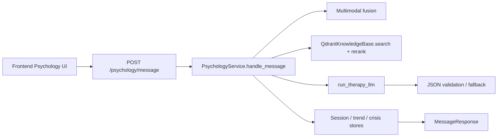

# Glunova AI Platform — Psychology Module
**Architecture and Implementation Guide (code-aligned)**

*Innova Team • ESPRIT • Class 3IA3 • 2026*

---

## Executive Summary

**Sanadi (سنَدي)** is Glunova’s multimodal psychology assistant for diabetic patients.  
It runs in the **`backend/fastapi_ai`** service (FastAPI) with:

- real-time emotion inference (face, speech, text), using Hugging Face Inference where configured or local pipelines,
- deterministic distress fusion and mental-state classification,
- CBT-oriented RAG (dynamic top‑k, hybrid rerank with mental-state topic boost) + Groq LLM response generation,
- Qdrant episodic memory, optional Groq translation before memory upsert, session-end consolidation into **`semantic_profile_json`** on **`PsychologyProfile`**,
- crisis safety gating and physician-review controls,
- session, trends, crisis, and KB observability endpoints,
- offline evaluation harness (RAGAS + DeepEval; provider keys via env),

This document matches the code under **`backend/fastapi_ai/psychology/`** and Django ORM models in **`backend/django_app/psychology/`** (tables the FastAPI repositories use).

**Router mount:** `main.py` includes the psychology router at **`/psychology/*`** (no extra global prefix).

---

## 1) Runtime Architecture

| Layer | Main pieces |
|---|---|
| Frontend | Psychology dashboard / chat UI (Next.js app under `frontend/`) |
| API | `psychology/router.py` — REST + WebSocket |
| Core | `PsychologyService` in `psychology/service.py`; `create_psychology_service()` wires DB-backed or in-memory stores |
| Knowledge / RAG | `QdrantKnowledgeBase` in `psychology/knowledge_ingestion.py`; dynamic `k` via `psychology/kb_retrieval.py` |
| Episodic memory | Qdrant collection **`qdrant_collection_memory`** (`patient_memory` by default); decay + clinical rerank in `psychology/patient_memory.py` |
| Session consolidation | `psychology/memory_consolidation.py` (Groq); model **`psychology_consolidation_model`** (default `llama-3.1-8b-instant`). When **`psychology_consolidation_defer`** is true and Postgres is used, consolidation runs after the HTTP response (background) for snappier session end. |
| Persistence | PostgreSQL via `psychology/repositories.py` → Django tables (`psychology_*`); in-memory stores if the pool is unavailable |
| Safety | Crisis probability + triggers + logging + **`physician_review_required`** on profile |
| Voice | `psychology/voice_service.py` — Groq Whisper STT; ElevenLabs TTS with word-level timestamps (JSON to clients) |

### Request path (chat turn)



---

## 2) Input modalities and fallback behavior

The message pipeline accepts optional camera/audio signals and always processes text:

- **`text`** is required in practice, or supplied via **`speech_transcript`** (merged in `MessageRequest`).
- **`face_frame_base64`** optional.
- **`speech_audio_base64`** optional.
- Optional client hints (skip server inference): **`face_emotion`** + **`face_confidence`**, **`speech_emotion`** + **`speech_confidence`**.
- Cached face evidence (recent window) can be reused when the current frame fails or is omitted — see **`PsychologyService._fusion`** in `service.py`.
- Text-only sessions are fully supported.

Implemented in **`_fusion()`** and **`MessageRequest`** validators in **`psychology/schemas.py`**.

### Voice endpoints (patient session UI)

Browser capture calls the same RBAC as **`POST /psychology/message`**: roles **`patient`**, **`doctor`** (not **`caregiver`**).

| Endpoint | Role | Description |
|---|---|---|
| **`POST /psychology/voice/transcribe`** | patient, doctor | Multipart field **`audio`**; optional form **`language_hint`** (`en`, `fr`, `ar`, `darija`, `mixed`). Groq Whisper — model **`psychology_voice_stt_model`** (default `whisper-large-v3-turbo`). Requires **`GROQ_API_KEY`**. Max size **`psychology_voice_max_upload_bytes`** (default 10 MiB). Returns JSON with **`text`** and optional **`language_guess`** (`VoiceTranscribeResponse`; 422 if no speech detected). |
| **`POST /psychology/voice/synthesize`** | patient, doctor | JSON **`VoiceSynthesizeRequest`**: **`text`** (1–4000 chars), **`language`**, optional **`gender`** (`female` \| `male`, default `female`). **ElevenLabs only** via **`/v1/text-to-speech/{voice_id}/with-timestamps`**. Response body is **`application/json`** (not raw MP3): **`audio_b64`**, **`content_type`**, **`words`**, **`wtimes`** (ms), **`wdurations`** (ms). Requires **`ELEVENLABS_API_KEY`**. Model **`psychology_elevenlabs_model`** (default `eleven_multilingual_v2`); voices per language/gender: **`psychology_elevenlabs_voice_en`**, **`psychology_elevenlabs_voice_ar`**, **`psychology_elevenlabs_voice_en_male`**, **`psychology_elevenlabs_voice_ar_male`**. Set **`psychology_tts_provider=none`** to disable TTS (returns 501 / `VoiceConfigurationError`). Any other TTS provider value in env is **normalized to `elevenlabs`** with a warning (`core/config.py`). |

---

## 3) Emotion + mental state stack

### 3.1 Emotion inference

Settings live in **`core/config.py`**. Remote vs local is governed by **`psychology_emotion_inference_mode`**: **`auto`** | **`inference_api`** | **`local`**.

- **`auto`**: uses HF Inference for embeddings (KB path) and for modalities that have a token and allowed remote path; local fallbacks where not.
- Token resolution: **`psychology_hf_api_token`**, else **`HF_TOKEN`** / **`HUGGINGFACE_HUB_TOKEN`**.
- **`psychology_hf_inference_provider`**: Hub provider routing for the Inference client (default **`auto`**; **`hf-inference`** for legacy proxy if needed).
- **`psychology_hf_inference_timeout_s`**: remote call timeout (default 8s).

| Modality | Implementation notes |
|---|---|
| Face | **`psychology_face_emotion_model`** (default `mo-thecreator/vit-Facial-Expression-Recognition`). Mapped to Sanadi’s five labels in **`PsychologyService._map_face_label_generic`**. |
| Speech | Local ModelScope / emotion2vec pipeline: **`psychology_speech_emotion_model`** (default `iic/emotion2vec_plus_large`). Optional HF Inference audio classification when **`psychology_speech_emotion_use_hf_inference`** is true — repo **`psychology_speech_emotion_hf_model`** (default `superb/hubert-large-superb-er`). |
| Text | Fast heuristics by default. If **`psychology_text_emotion_use_hf`** forces local **`transformers`**, or Inference is used when token + mode allow: **`psychology_text_emotion_model`**, with optional fallback **`psychology_text_emotion_hf_fallback_model`**. Explicit Inference-only flag: **`psychology_text_emotion_use_hf_inference`** (default false; many Hub models are not on Inference). |
| Embeddings (Qdrant) | Model **`qdrant_embedding_model`** (default `sentence-transformers/all-MiniLM-L6-v2`). **`QdrantKnowledgeBase`** prefers HF Inference embedding when a token is set and mode is not **`local`**; otherwise sentence-transformers locally. **`qdrant_vector_size`** must match the collection (default 384 for MiniLM). |

### 3.2 Multimodal fusion (distress)

Server-side fusion is **deterministic**: per-modality distress proxies, entropy-based **`gate_weight`**, then blended **`distress_score`** — see **`_fusion()`** in **`service.py`**.

### 3.3 Fusion output schema (illustrative)

```json
{
  "label": "anxious",
  "distress_score": 0.42,
  "confidence": 0.78,
  "stress_level": 4,
  "sentiment_score": -0.4,
  "modalities_used": ["text", "face"]
}
```

### 3.4 Mental state classification

Rule-based (not a separate classifier model):

- **`Crisis`** if **`crisis_detected`**: **`_crisis_trigger`** — single-turn crisis probability **`>= CRISIS_THRESHOLD` (0.75)** or rolling history rule (see **`service.py`**).
- Else trend-adjusted distress: **`adjusted = distress + max(0, trend_slope) * 0.03`** (slope from last 7 **`PsychologyEmotionLog`** points), then thresholds for **`Depressed`**, **`Distressed`**, **`Anxious`**, **`Neutral`**.

---

## 4) Therapy generation (RAG + LLM)

Orchestrated in **`_therapy_reply_multimodal()`**:

1. **`resolve_kb_retrieval_limit()`** from message length + **`MentalState`**, clamped **`psychology_kb_limit_min`** … **`psychology_kb_limit_max`** (defaults 2–8, base **`psychology_kb_default_limit`** 5).
2. **`QdrantKnowledgeBase.search(..., mental_state=mental_state)`** — vector recall (**`psychology_kb_recall_limit`**, default 16), then hybrid rerank including **mental-state preferred `sanadi_topic` boost** (**`psychology_kb_mental_state_topic_boost`**).
3. **`_retrieval_quality`**: **`empty`** if no chunks; **`low_score`** if best hybrid score **< `MIN_RETRIEVAL_SCORE` (0.16)**; else **`ok`**.
4. Prompt build **`llm_therapy.py`**: user text + language + fusion + **`semantic_profile_compact`** + health JSON + up to **5** episodic lines + up to **4** KB snippets.
5. **`run_therapy_llm()`** → Groq **`settings.groq_model`** (default **`llama-3.3-70b-versatile`**), **`response_format: json_object`**.
6. Strict JSON validation; template / **`llm_low_context_fallback`** when retrieval is weak.

### LLM choice (production default)

- **Therapy:** **`groq_model`** — default **`llama-3.3-70b-versatile`** (latency + cost vs. closed APIs; JSON mode for structured replies).
- **Consolidation:** **`psychology_consolidation_model`** — default **`llama-3.1-8b-instant`**.
- **Platform vision (other modules):** **`groq_vision_model`** — default **`llama-3.2-11b-vision-preview`**. Sanadi chat uses text + optional face-derived signals from **`/psychology/emotion/frame`** and fusion, not this vision endpoint in **`llm_therapy.py`**.

### LLM JSON contract (internal)

```json
{
  "reply": "string",
  "technique": "string",
  "recommendation": "string|null",
  "citations": ["chunk_id_or_source"],
  "safety_mode": "normal|low_context|elevated_guard|crisis_guard"
}
```

### External API schema (`POST /psychology/message`)

Same shape as before: **`session_id`**, **`reply`**, **`emotion`**, **`distress_score`**, **`language_detected`**, **`technique_used`**, **`recommendation`**, **`crisis_detected`**, **`mental_state`**, **`fusion`**, **`physician_review_required`**, **`anomaly_flags`**, **`retrieval_quality`** (`ok` \| `low_score` \| `empty`).

---

## 5) Retrieval and knowledge base

### 5.1 Storage

- Qdrant **`qdrant_collection_cbt`** (default `cbt_knowledge`) and **`qdrant_collection_memory`** (default `patient_memory`); **`qdrant_url`**, **`qdrant_api_key`**.
- Chunk payload includes **`source_version`** = **`psychology_kb_source_version`** (default **`"3"`**) — bump and reindex when the corpus changes; search results expose **`kb_freshness`** (`current` \| `stale` \| `unknown`).
- Ingestion: manifest stubs (**`psychology/knowledge_ingestion.py`**) plus **`psychology data/sanadi_knowledge_base.md`** when present (resolved via **`psychology/pdf_kb.py`**: env **`psychology_data_dir`** or repo **`psychology data/`**). Chunking via **`psychology/chunking.py`** (`chunk_sanadi_kb_markdown`, etc.).

### 5.2 Hybrid rerank

Base blend: **`w_vec * vector_score + w_lex * lexical + w_cat * category_norm`** (lexical = token-set overlap; **`category_norm`** from **`_category_priority`**).

Then multipliers on the combined score:

- **`content_kind == manifest_stub`** → × **`psychology_kb_manifest_stub_rerank_multiplier`** (default **0.38**) so real Sanadi chunks beat manifest stubs.
- **`sanadi_topic`** in **preferred topics for current mental state** → × **`psychology_kb_mental_state_topic_boost`** (default **1.25**); topics from **`preferred_sanadi_topics_for_mental_state`** in **`kb_retrieval.py`**.
- Preamble chunks **`SANADI_PREAMBLE`** / **`sanadi_preamble`** → × **`psychology_kb_preamble_rerank_multiplier`** (default **0.82**).

Default weights: vector **0.75**, lexical **0.15**, category **0.10**. Optional JSON override file **`psychology_kb_rerank_config_path`** with keys **`vector`**, **`lexical`**, **`category`**.

Language filter: unless **`psychology_kb_english_only`** is true, search can constrain Qdrant by **`language`** payload (requires payload index; code retries without filter if the cluster reports missing index).

### 5.3 Markdown ingestion / reindex

- **`QdrantKnowledgeBase.reindex_sources()`** — embeds Sanadi markdown when present; otherwise manifest-only + warning.
- **`POST /psychology/knowledge/reindex`** — **doctor** only.

### 5.4 Ops / debug endpoints

| Method | Path | Roles | Notes |
|---|---|---|---|
| GET | **`/psychology/knowledge/search`** | doctor | Query params: **`q`**, **`language`**, **`limit`**, optional **`source_version`**, **`min_ingested_at`** (ISO; requires payload index). |
| GET | **`/psychology/knowledge/sources`** | doctor | Manifest listing |
| POST | **`/psychology/knowledge/reindex`** | doctor | Returns stats + **`qdrant_enabled`** |
| GET | **`/psychology/rag/health`** | doctor | Collection stats, rerank tunables, latency p50, **`configured_source_version`**, etc. |
| GET | **`/health/psychology`** | *(no auth)* | Lightweight probe: **`postgres_pool`**, **`qdrant_cbt`** booleans |

---

## 6) Safety and crisis controls

- Crisis probability from text; threshold + history trigger; crisis event persisted; safe static crisis reply; recommendation steers to clinician contact.
- Physician gate: blocks new sessions when active; **`POST /psychology/physician/clear-gate`** (**doctor**) clears.

### Runtime anomaly telemetry

**`anomaly_flags`** on **`/psychology/message`** may include retrieval / LLM / safety families (see **`handle_message`** and **`_therapy_reply_multimodal`** in **`service.py`**), e.g. **`retrieval_low_score`**, **`retrieval_empty`**, **`llm_parse_fallback`**, **`fusion_abrupt_jump`**, guard modes, etc.

---

## 7) Session, trends, memory, storage

**`create_psychology_service()`** uses **`psychology/db.get_connection_pool()`**:

- With pool: **`PsqlSessionStore`**, **`PsqlCrisisStore`**, **`PsqlTrendStore`** → Django-aligned tables (**`PsychologySession`**, **`PsychologyMessage`**, **`PsychologyCrisisEvent`**, **`PsychologyEmotionLog`**, **`PsychologyProfile`**, …).
- Without pool: in-memory stores (dev only).

**Episodic memory:** **`build_memory_store()`** in **`patient_memory.py`**, tuned by **`psychology_memory_*`**. Session turns use **`psychology_memory_search_limit`** (bounded in code between 3 and 12). Optional **English translation** before Qdrant upsert: **`psychology_memory_translate_to_english`** (Groq).

**Session end:** **`run_session_consolidation()`** updates **`semantic_profile_json`** and may set **`physician_review_required`**. **`mem0_enabled`** in config is reserved: when true, consolidation still uses the native Groq path and only logs that Mem0 was requested (**`memory_consolidation.py`**).

### RBAC snapshot (`router.py`)

| Pattern | Roles |
|---|---|
| **`/session/start`**, **`GET /session/{id}`**, **`GET /sessions/history/{patient_id}`**, **`GET /trends/{patient_id}`** | patient, doctor, caregiver — patients may only read **their own** history (see **`_assert_session_history_access`**) |
| **`/message`**, **`/emotion/frame`**, **`/voice/*`**, **`/session/end`**, **`WS /ws/emotion/{patient_id}`** | patient, doctor |
| **`GET /crisis/events`**, **`POST /crisis/ack`** | doctor, caregiver (caregiver **must** pass **`patient_id`** on ack) |
| **`/physician/clear-gate`** | doctor |
| **`/knowledge/*`**, **`GET /rag/health`** | doctor |

WebSocket **`/psychology/ws/emotion/{patient_id}`**: token via query **`token`** or cookie **`access_token`**; **patient** may only subscribe to **own** **`patient_id`**. Per-frame inference **`asyncio.wait_for(..., 2.5s)`**; loop sleep **~0.25s** (~4 fps). Client sends JSON **`{ "frame_base64": "..." }`** per frame.

### Core REST endpoints

- `POST /psychology/session/start`
- `POST /psychology/message`
- `POST /psychology/session/end`
- `GET /psychology/session/{session_id}`
- `GET /psychology/sessions/history/{patient_id}?limit=…` (default 25, max 60)
- `GET /psychology/trends/{patient_id}`
- `GET /psychology/crisis/events?patient_id=…` (optional filter)
- `POST /psychology/crisis/ack`

---

## 8) API schemas (request examples)

### 8.1 Start session

```json
{
  "patient_id": 123,
  "preferred_language": "en"
}
```

### 8.2 Message

```json
{
  "session_id": "uuid",
  "patient_id": 123,
  "text": "I feel overwhelmed today",
  "face_frame_base64": null,
  "face_emotion": null,
  "face_confidence": null,
  "speech_audio_base64": null,
  "speech_emotion": null,
  "speech_confidence": null,
  "speech_transcript": null
}
```

### 8.3 Emotion frame

```json
{
  "patient_id": 123,
  "frame_base64": "data:image/jpeg;base64,..."
}
```

### 8.4 Voice synthesize (request)

```json
{
  "text": "Short supportive reply text.",
  "language": "en",
  "gender": "female"
}
```

Response: JSON with **`audio_b64`**, **`words`**, **`wtimes`**, **`wdurations`** — decode **`audio_b64`** client-side to MP3 bytes.

---

## 9) Evaluation architecture

Package: **`backend/fastapi_ai/psychology/evaluation/`**

- **RAGAS** — retrieval / grounding style metrics
- **DeepEval** — answer quality / safety style scoring
- Keys from **`backend/.env`**; Gemini / OpenAI supported per eval scripts
- Reports under **`backend/fastapi_ai/tmp/sanadi_eval_reports/`**

Entry scripts include **`backend/fastapi_ai/scripts/run_sanadi_evaluation.py`**.

---

## 10) Operational notes

- First run may download local **`transformers`** / ModelScope weights when **`psychology_emotion_inference_mode=local`** or when remote paths fail.
- Align **`qdrant_vector_size`** with the embedding model and existing Qdrant collection.
- ElevenLabs / Groq rate limits and quotas affect voice and therapy latency; disable TTS with **`psychology_tts_provider=none`** if keys are absent.
- For Qdrant filtered search (`language`, **`source_version`**, **`ingested_at`**), ensure payload indexes exist on the cluster or expect automatic retry without language filter when indexes are missing.

---

## 11) Technology stack (snapshot)

| Area | Implementation |
|---|---|
| API | FastAPI; JWT via **`core.security`** / **`core.rbac`** |
| Orchestration | **`PsychologyService`** |
| Therapy LLM | **`groq_model`** (default `llama-3.3-70b-versatile`) |
| Consolidation LLM | **`psychology_consolidation_model`** (default `llama-3.1-8b-instant`) |
| STT | Groq Whisper — **`psychology_voice_stt_model`** |
| TTS | ElevenLabs multilingual + timestamps — **`psychology_elevenlabs_model`**, voice ID settings |
| Face / speech / text emotion | HF Inference +/or local pipelines per **`core/config`** |
| Embeddings | **`qdrant_embedding_model`**; optional HF Inference for KB indexing/search when token + mode allow |
| Vector DB | Qdrant (**`qdrant_collection_cbt`**, **`qdrant_collection_memory`**) |
| Evaluation | RAGAS + DeepEval |

---

*Confidential — Glunova AI Platform — Psychology module architecture (aligned with current implementation)*
