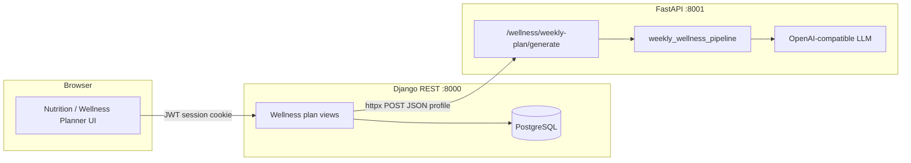

# Weekly Wellness Plan — Architecture

This document describes how the **weekly wellness plan** feature is structured across Glunova: data model, HTTP APIs, AI generation pipeline, cross-cutting integrations (care agent, psychology), and the frontend surface.

---

## 1. Purpose and scope

The weekly wellness plan is a **patient-facing** capability that produces a **7-day (Monday–Sunday) schedule** of:

- **Meals** — typed meals (breakfast through workout snacks) with macros, glycemic cues, and diabetes rationale.
- **Exercise sessions** — typed workouts with intensity, duration, equipment, and glucose-related guidance.

Plans are **anchored to the calendar week** (`week_start` = Monday of the current week). Generation is **LLM-driven** (two-stage pipeline) and **persisted in PostgreSQL** via Django. The FastAPI service performs generation only; **Django owns auth, RBAC, and persistence**.

---

## 2. High-level system view

- **Frontend** calls Django under `/api/v1/nutrition/wellness-plan/*` (see `frontend/lib/wellness-api.ts`).
- **Django** builds a `WeeklyWellnessPlanRequest`-shaped JSON payload, posts it to FastAPI, then **normalizes and stores** the JSON response into `WeeklyWellnessPlan`, `Meal`, and `ExerciseSession`.

---

## 3. Data model (Django / PostgreSQL)

Defined in `backend/django_app/nutrition/models.py`.

| Model | Role |
|-------|------|
| **`WeeklyWellnessPlan`** | One row per **(patient, week_start)**. Holds `status` (`pending` / `ready` / `failed`), preferences snapshot (`fitness_level`, `goal`, `cuisine`), `generated_at`, **`clinical_snapshot`** (full request profile used for generation / regen), and **`week_summary`** (merged LLM week-level stats). |
| **`Meal`** | Rows linked via `wellness_plan`. Uniqueness: **`(wellness_plan, day_index, meal_type)`**. Stores macros, GI/GL labels, ingredients JSON, `status` for adherence. |
| **`ExerciseSession`** | Rows linked via `wellness_plan` + `patient`. Includes `day_index` (0–6), intensity, duration, equipment, diabetes fields, `scheduled_for`, `status`. |

**Nutrition goals** (`NutritionGoal`) are not part of the plan row itself but feed **`_build_wellness_profile`** (latest goal by `valid_from`) for calorie/macro targets and derived per-meal carb hints.

---

## 4. Request contract: `WeeklyWellnessPlanRequest`

Pydantic schema: `backend/fastapi_ai/wellness/weekly_wellness_schema.py`.

- **Identity**: `patient_id`
- **Clinical**: age, anthropometrics, `bmi`, diabetes type, `hba1c`, `last_glucose`, medications, allergies, comorbidity flags
- **Nutrition**: `cuisine`, `carb_limit_per_meal_g`, optional macro targets from goals
- **Fitness**: `fitness_level`, `goal`, `sessions_per_week`, `minutes_per_session`, equipment, injuries
- **Week control**: `week_start` (ISO date); **`day_index`** optional — `None` = full week; `0–6` = single-day regeneration

Django’s `_build_wellness_profile` assembles this from **`PatientProfile`**, **`PatientMedication`** (matched only), **`NutritionGoal`**, and POST body overrides. **`week_start`** is computed as **Monday of the current local calendar week** (`date.today() - timedelta(days=weekday())`).

---

## 5. Django REST API

Routes: `backend/django_app/nutrition/urls.py`. Base path: **`/api/v1`** + prefixes below (also set `NEXT_PUBLIC_API_PREFIX` on the client).

| Method | Path | Actor | Behavior |
|--------|------|-------|----------|
| POST | `/nutrition/wellness-plan/generate` | **Patient only** | Build profile → FastAPI → `_persist_wellness_plan` → serialized plan (**201**). |
| POST | `/nutrition/wellness-plan/<pk>/regenerate-day` | Patient (owner) | Merge stored `clinical_snapshot` with `day_index` → FastAPI → persist overlapping days → **200**. |
| GET | `/nutrition/wellness-plan/current` | Patient, doctor, caregiver | **`patient_id` query** optional for staff/caregiver scope. Returns latest **READY** plan by `week_start` or **404**. |
| GET | `/nutrition/wellness-plan/<pk>` | Same scope | Detail by primary key. |
| PATCH | `/nutrition/exercise/<pk>/status` | Patient | Update session `planned` / `completed` / `skipped`. On transition to **skipped**, may trigger care agent (see §8). |
| PATCH | `/nutrition/meal/<pk>/status` | Patient | Same pattern for meals. |

**Authorization**:

- `_resolve_patient_scope` maps **doctor** → scoped patient IDs, **caregiver** → accepted links, **patient** → self.
- Full-week generation is restricted to **`role == patient`**; caregivers/doctors use **read** endpoints with `patient_id` where applicable.

**Persistence** (`_persist_wellness_plan`):

- `update_or_create` on `(patient, week_start)`.
- For each generation, **delete** existing `Meal` / `ExerciseSession` rows for **`day_index` values present in the payload** for that plan, then **bulk_create** new rows (avoids stale meals/sessions on regen).

**Serialization** (`_serialize_wellness_plan`):

- Expands to **7 fixed day slots** (`day_index` 0–6), attaching meals and sessions grouped by day.

---

## 6. FastAPI generation service

Router: `backend/fastapi_ai/wellness/router.py`  

- **`POST /wellness/weekly-plan/generate`** — async wrapper around synchronous `generate_weekly_wellness_plan` via **`run_in_executor`** (non-blocking event loop).
- **`GET /wellness/health`** — lightweight check including whether `OPENAI_API_KEY` is set.

Mounted in `backend/fastapi_ai/main.py` with `app.include_router(wellness_router)`.

### 6.1 Pipeline: `weekly_wellness_pipeline.py`

**Stage 1 — Exercise**

- Prompt: `_exercise_prompt` includes `_clinical_block` (BMI, HbA1c bands, meds, ADA-oriented exercise rules) + fitness preferences + **only the target day indices** (full week or single day).
- LLM returns JSON with **`exercise_week_summary`** and **`days`** with **`sessions`** (mapped later to `exercise_sessions` in persistence).

**Stage 2 — Meals**

- Prompt: `_meal_prompt` uses the **same clinical block**, cuisine copy, and **per-day exercise context** (rest vs active, load, intensity) so pre/post workout snacks align with training days.
- For token limits, **meals are generated in chunks of up to 4 days** (`chunk_size = 4`), then merged via `_merge_meal_chunks`.

**Merge**

- `_merge` combines exercise and meal stage outputs into **`week_summary`** (exercise + meal summaries flattened) and **`days`** each with `exercise_sessions` and `meals`.

**LLM client**

- `wellness/navy_openai.py`: OpenAI-compatible client; **`OPENAI_BASE_URL`** (default Navy), **`OPENAI_API_KEY`**, optional TLS (`OPENAI_SSL_VERIFY`, `OPENAI_CA_BUNDLE`), **`OPENAI_MODEL`**.

**Errors**

- JSON is extracted from possibly fenced LLM text (`_extract_json`).
- API failures are summarized for firewall/TLS issues (`_summarize_llm_api_error`).

---

## 7. Frontend

Primary UI: `frontend/app/dashboard/nutrition/wellness-planner/page.tsx` (`WellnessPlannerTabContent`), embedded from the nutrition dashboard.

- **`wellness-api.ts`**: typed `WeeklyWellnessPlan`, `generateWellnessPlan`, `getWellnessPlan(patientId?)`, `regenerateWellnessDay`, `updateExerciseStatus`, `updateMealStatus`.
- Uses **`credentials: 'include'`** against Django (`NEXT_PUBLIC_API_URL`, `NEXT_PUBLIC_API_PREFIX`).
- Patients **generate**; doctors/caregivers typically **view** via `patient_id` on `current`.

---

## 8. Integrations outside the nutrition module

### 8.1 Care coordination agent

- Skipping a **meal** or **exercise** session triggers `_maybe_trigger_agent_on_skip` → `POST {AI_SERVICE_URL}/agent/coordinate` with `trigger: "nutrition_skip"` (fire-and-forget thread).
- **MCP tool** `get_nutrition_summary` (`agent/mcp_server.py`) reads `nutrition_weeklywellnessplan` and related counts; exposes `last_agent_run` from **`clinical_snapshot`** JSON for orchestrator logic.
- **Orchestrator** (`agent/orchestrator.py`): **cooldown** (default 30 minutes) uses wellness plan snapshot **`last_agent_run`** to avoid duplicate dispatches; **`nutrition_skip`** bypasses cooldown among other triggers.

### 8.2 Psychology / Sanadi context

- `psychology/repositories.py` enriches patient context with **latest weekly wellness plan** metadata and **meal completed/skipped counts** for the current plan id, so conversational AI can reference adherence.

### 8.3 Evaluation

- `wellness/evaluation/` — runs `generate_weekly_wellness_plan` against fixtures / DeepEval (`scripts/run_wellness_evaluation.py`, eval JSONL). Used for **quality regression** of plan generation, not runtime.

---

## 9. Configuration summary

| Variable / setting | Role |
|--------------------|------|
| **`AI_SERVICE_URL`** (Django `settings`) | Base URL for FastAPI (default `http://localhost:8001`). |
| **`OPENAI_API_KEY`**, **`OPENAI_BASE_URL`**, **`OPENAI_MODEL`** | LLM access from FastAPI wellness pipeline. |
| **`OPENAI_SSL_VERIFY`**, **`OPENAI_CA_BUNDLE`**, **`OPENAI_HTTP_TIMEOUT`** | Network/TLS for LLM client. |

---

## 10. Key files (quick index)

| Area | Path |
|------|------|
| Models | `django_app/nutrition/models.py` |
| REST + persistence | `django_app/nutrition/views.py`, `django_app/nutrition/urls.py` |
| FastAPI routes | `fastapi_ai/wellness/router.py`, `fastapi_ai/main.py` |
| LLM pipeline | `fastapi_ai/wellness/weekly_wellness_pipeline.py` |
| Request schema | `fastapi_ai/wellness/weekly_wellness_schema.py` |
| OpenAI client | `fastapi_ai/wellness/navy_openai.py` |
| Frontend API + types | `frontend/lib/wellness-api.ts` |
| UI | `frontend/app/dashboard/nutrition/wellness-planner/page.tsx` |
| Agent / MCP | `fastapi_ai/agent/mcp_server.py`, `fastapi_ai/agent/orchestrator.py` |

---

## 11. Design notes and limitations (as implemented)

- **Single “current” plan for scoped users**: `WellnessPlanCurrentView` returns the latest **READY** plan by `week_start`, not strictly “this calendar week only”; operators should be aware when testing across week boundaries.
- **Exercise `scheduled_for`**: On create, Django sets **`timezone.now()`** for all new sessions—not a true calendar slot per weekday (display logic uses `day_index` for the week grid).
- **Full regeneration vs day regen**: Both hit the same FastAPI endpoint; the pipeline restricts **exercise and meal generation to `target_days`** when `day_index` is set, but merge logic still builds merged structures; persistence replaces only days present in the returned payload.
- **Patient-only generation**: Reduces abuse and keeps LLM cost on the patient account; staff rely on patient-initiated generation or future automation.

---

*Document aligned with the Glunova codebase layout (Django + FastAPI + Next.js). Update this file when adding async plan generation, webhooks, or multi-week history UX.*
