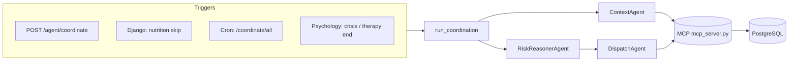

# Glunova Care Coordination Agent — Architecture

This document describes the **care coordination agent** under `backend/fastapi_ai/agent/`. It is a **multi-agent, single-orchestrator** pipeline: one MCP (stdio) session loads allowed patient context, a **RiskReasoner** Groq LLM (**`llama-3.3-70b-versatile`** by default) produces structured coordination output, and a **Dispatch** Groq LLM (**`llama-3.1-8b-instant`** by default) issues tool calls to persist messages in PostgreSQL.

---

## 1. Purpose

The agent **proactively coordinates care** by:

1. Loading **allowed** patient context (nutrition / weekly plan and activity adherence, psychology, care team).
2. Producing **role-specific draft messages** (patient nudge, caregiver update, doctor summary) keyed off a **trigger** (meal skip, therapy end, crisis, etc.).
3. **Persisting** those messages as **Monitoring health alerts** (patient + doctor) and **Care Circle family updates** (each linked caregiver).

It does **not** consume formal **screening outputs** or **risk-assessment** feeds as model input (those MCP tools were removed from the context path). The output field name `risk_tier` in JSON is **coordination urgency** inferred from the allowed context only, not a clinical stratification score from the monitoring fusion engine.

---

## 2. High-level layout

| Piece | Role | LLM |
|--------|------|-----|
| **FastAPI** (`agent/router.py`) | HTTP entry: `POST /agent/coordinate`, `POST /agent/coordinate/all` | — |
| **Orchestrator** (`orchestrator.py`) | End-to-end run: start MCP subprocess → Context → Risk reasoner → Dispatch; owns the **single** `ClientSession` | — |
| **MCP server** (`mcp_server.py`, stdio subprocess, **FastMCP**) | DB-backed tools: `get_nutrition_summary`, `get_psychology_state`, `get_care_team`, `dispatch_update` | — |
| **ContextAgent** (`agents/context_agent.py`) | `asyncio.gather` of the three read-tools → `PatientContext` | **None** (MCP reads only) |
| **RiskReasonerAgent** (`agents/risk_reasoner_agent.py`) | Groq chat completion (`response_format: json_object`) → `ReasoningOutput` | **Groq** · default **`llama-3.3-70b-versatile`** · `settings.groq_model` · env **`GROQ_MODEL`** |
| **DispatchAgent** (`agents/dispatch_agent.py`) | Groq chat with **function** tool `dispatch_update` (multi-round loop, max 6) → `DispatchResult` | **Groq** · default **`llama-3.1-8b-instant`** · `settings.psychology_consolidation_model` · env **`PSYCHOLOGY_CONSOLIDATION_MODEL`** |

**Authentication:** RiskReasoner and Dispatch both use **`GROQ_API_KEY`** (`settings.groq_api_key`).

The orchestrator starts **one** MCP client session per `run_coordination` and passes that `ClientSession` into ContextAgent and DispatchAgent so all tool calls share the same connection.

---

## 3. End-to-end sequence

**Ordered steps inside `run_coordination`:**

1. **Start MCP** — `stdio_client` + `ClientSession` to `mcp_server.py` (same Python interpreter as the API process).
2. **ContextAgent** — parallel `call_tool` for `get_nutrition_summary`, `get_psychology_state`, `get_care_team` → `PatientContext`.
3. **Cooldown guard** — may **return early** without calling the reasoner (see §6).
4. **RiskReasonerAgent** — `risk_reasoner_agent.run(ctx, trigger)` → `ReasoningOutput`.
5. **Optional no-dispatch exit** — if `should_dispatch` is false and trigger is not force-dispatched, return without dispatch (see §6).
6. **DispatchAgent** — `dispatch_agent.run(reasoning, care_team, session)` → MCP `dispatch_update` tool calls.
7. **Close MCP session** when the `async with` blocks exit.

---

## 4. HTTP API (FastAPI)

Mounted in `main.py` with prefix **`/agent`**:

| Method | Path | Body | Purpose |
|--------|------|------|---------|
| `POST` | `/agent/coordinate` | `CoordinateRequest`: `patient_id`, `trigger` | Run for one patient |
| `POST` | `/agent/coordinate/all` | `CoordinateAllRequest`: `trigger` (`cron` \| `manual`) | Batch: distinct `patient_id` from **active** `monitoring_healthalert` rows in the **last 24 hours** |

**`POST /coordinate/all` implementation notes:**

- Uses **`core.db.get_connection_pool()`** (same app DB as Django/FastAPI). Returns **503** if the pool is unavailable.
- Iterates patients sequentially; collects **per-patient errors** in `CoordinateAllResponse.errors` without failing the whole batch.

**Triggers** (`CoordinateRequest.trigger`):

| Value | Typical meaning |
|--------|------------------|
| `nutrition_skip` | Patient marked a meal or exercise session skipped (wellness planner) |
| `therapy_session` | Therapy session ended; post-session summaries (psychology service) |
| `crisis` | Psychology crisis event persisted |
| `cron` / `manual` | Scheduled batch (`/coordinate/all`) or explicit single-patient run; see §6 for **cooldown** vs event-driven triggers |

**Integration pitfall:** `django_app/monitoring/management/commands/run_coordination_agent.py` defaults `--trigger` to `nightly`, but the FastAPI body only allows **`cron`** or **`manual`**. Use e.g. `python manage.py run_coordination_agent --trigger cron` (or align the command default with the API).

---

## 5. Data contracts (`schemas.py`)

- **`PatientContext`** — `patient_id`, `nutrition` (dict), `psychology` (dict), `care_team` (dict).  
  No monitoring/screening/risk-assessment payloads in this object.

- **`ReasoningOutput`** — `patient_id`, `risk_tier`, `priority_level`, `key_signals`, `should_dispatch`, `patient_nudge`, `caregiver_update`, `doctor_summary`.

- **`DispatchResult`** — `patient_id`, `messages_dispatched`, `recipients` (list of recipient types successfully dispatched).

- **`CoordinateResponse`** — `status`, `patient_id`, `messages_dispatched`, `trigger`, optional `risk_tier`, `skipped_reason` when skipped or no dispatch.

- **`CoordinateAllResponse`** — `patients_processed`, `messages_dispatched`, `errors` (string messages for failed patients).

---

## 6. Cooldown and “force dispatch”

Implemented in `orchestrator.py` (`_COOLDOWN_MINUTES = 30`, `_is_cooled_down` reads `nutrition.plan.last_agent_run`).

**Cooldown applies only when:**

- `open_crisis == 0` (from `get_psychology_state`), **and**
- `trigger` is **not** in `{"nutrition_skip", "crisis", "therapy_session"}`.

Then if `last_agent_run` on the latest weekly plan is **< 30 minutes** ago (ISO timestamp in the plan JSON), the orchestrator **returns immediately** with `status="skipped"` — **RiskReasonerAgent is not invoked**.

**Triggers that never hit the cooldown gate:** `nutrition_skip`, `crisis`, `therapy_session`.

**Open crisis:** If `open_crisis > 0`, the cooldown block is skipped for **any** trigger.

**Force dispatch:** If `trigger` ∈ `{"manual", "nutrition_skip", "crisis", "therapy_session"}`, the pipeline **continues to DispatchAgent** even when `should_dispatch` is false in `ReasoningOutput`. Otherwise, `should_dispatch` false causes an early return with `messages_dispatched=0` and `skipped_reason="signals within normal range"`.

Note: **`manual` is not cooldown-exempt** — it only affects the force-dispatch branch after reasoning.

---

## 7. MCP tools (`mcp_server.py`)

The MCP process uses **psycopg** and the same **`database_url`** as FastAPI (`core.config.settings`), via `normalize_postgres_conninfo`.

### Read tools (ContextAgent)

| Tool | Returns (conceptually) |
|------|-------------------------|
| **`get_nutrition_summary`** | Latest weekly wellness plan (within lookback), **`last_agent_run`** from `clinical_snapshot` merged onto the plan object, **count of skipped exercise sessions (7d)**, latest nutrition goal macros. |
| **`get_psychology_state`** | Latest emotion assessment, therapy session count (7d), **unacknowledged** crisis count (`open_crisis`), **`last_completed_session`** (latest ended `psychology_psychologysession`: ids, times, `last_state`, size-capped `session_summary_json`). |
| **`get_care_team`** | Linked doctor (patient–doctor link) and **accepted** caregivers (`documents_patientcaregiverlink.status = 'accepted'`). |

### Write tool (DispatchAgent)

| Tool | Behavior |
|------|----------|
| **`dispatch_update`** | **`caregiver`** → `INSERT` into `carecircle_familyupdate` (`source='agent'`). **`patient`** / **`doctor`** → `INSERT` into `monitoring_healthalert` with `severity='info'`, `status='active'`, `agent_audience` set. Then **merges** into `nutrition_weeklywellnessplan.clinical_snapshot` a JSON object `{"last_agent_run": <ISO UTC>, "recipient_type": <string>}` on the patient’s latest plan row (cooldown + audit). |

---

## 8. RiskReasonerAgent (`agents/risk_reasoner_agent.py`)

- **Provider:** Groq (`settings.groq_api_key`).
- **Model:** `settings.groq_model` (default `llama-3.3-70b-versatile`).
- **Output:** JSON object parsed into `ReasoningOutput`; malformed JSON falls back to safe defaults (`should_dispatch` inferred from tier if missing).

The **user prompt** includes:

- A **trigger-specific block** (`_TRIGGER_FOCUS`): explicit text for `nutrition_skip`, `cron`, `crisis`, `therapy_session`.
- Unknown triggers (including **`manual`**) use the **same focus text as `cron`** (`_TRIGGER_FOCUS.get(trigger, _TRIGGER_FOCUS["cron"])`).
- `NUTRITION_AND_ACTIVITY` and `PSYCHOLOGY` JSON dumps.
- Care-team presence flags.

The **system prompt** restricts scope to nutrition/activity + psychology and forbids inventing screening or risk-stratification data.

---

## 9. DispatchAgent (`agents/dispatch_agent.py`)

- **Provider:** Groq.
- **Model:** `settings.psychology_consolidation_model` (default `llama-3.1-8b-instant`).
- **Mechanism:** Chat completions with a single **function** tool schema for `dispatch_update`. The model may emit multiple tool calls per turn; the agent runs up to **6** rounds until there are no more `tool_calls` (budget for patient + caregivers + doctor + slack).

**Rules given to the model:** dispatch `patient_nudge` to the patient; one message per caregiver if `caregiver_update` is set and caregivers exist; doctor message if `doctor_summary` is set and a doctor is linked; **do not rewrite** drafts — send verbatim.

**Deduplication:** Duplicate tool calls for the same logical recipient `(recipient_type, recipient_id)` in one run append a synthetic tool response `{"ok": true, "deduped": true}` and **do not** hit the DB again.

**Titles:** System text maps contexts to example titles (“Meal Check-in”, “Therapy Session Summary”, “Crisis Support Alert”, etc.).

---

## 10. External callers (outside FastAPI route)

These invoke coordination **directly or via HTTP** (often `AI_SERVICE_URL` in Django, `http://127.0.0.1:8001` by default):

| Source | Trigger | Notes |
|--------|---------|--------|
| `django_app/nutrition/views.py` | `nutrition_skip` | After PATCH transitions meal/exercise to `skipped`; daemon thread + `httpx` → `POST …/agent/coordinate`. |
| `fastapi_ai/psychology/repositories.py` | `crisis` | After crisis persistence; thread + `asyncio.run(run_coordination(...))` **in-process** on the FastAPI side. |
| `fastapi_ai/psychology/service.py` → `spawn_therapy_session_coordination` in `repositories.py` | `therapy_session` | After session end persistence; daemon thread + `asyncio.run(run_coordination(...))`. |

**Batch / cron:**

- `django_app/monitoring/management/commands/run_coordination_agent.py` → **`POST …/agent/coordinate/all`** with JSON `{"trigger": "cron"}` or `{"trigger": "manual"}` (see §4 for `nightly` default mismatch).

---

## 11. Configuration (environment)

Per-agent defaults are summarized in **§2** (table column **LLM**). Source of truth for defaults: `backend/fastapi_ai/core/config.py`.

Relevant FastAPI / agent settings:

- **`GROQ_API_KEY`** — required for RiskReasoner and Dispatch agents (`settings.groq_api_key`).
- **`GROQ_MODEL`** — RiskReasoner model id (`settings.groq_model`, default **`llama-3.3-70b-versatile`**).
- **`PSYCHOLOGY_CONSOLIDATION_MODEL`** — Dispatch agent model id (`settings.psychology_consolidation_model`, default **`llama-3.1-8b-instant`**; name is shared with psychology session-consolidation settings).
- **`database_url`** — MCP tools; `/coordinate/all` patient discovery; Django ORM.
- **`AI_SERVICE_URL`** — used by Django to reach FastAPI.

---

## 12. File map

| Path | Responsibility |
|------|----------------|
| `fastapi_ai/agent/orchestrator.py` | Coordination loop, cooldown, MCP session lifecycle |
| `fastapi_ai/agent/router.py` | REST endpoints, batch query + error aggregation |
| `fastapi_ai/agent/schemas.py` | Pydantic request/response and inter-agent models |
| `fastapi_ai/agent/mcp_server.py` | MCP stdio server (FastMCP): tools + DB writes |
| `fastapi_ai/agent/agents/context_agent.py` | Parallel MCP reads → `PatientContext` |
| `fastapi_ai/agent/agents/risk_reasoner_agent.py` | Groq JSON reasoning (`groq_model` → default `llama-3.3-70b-versatile`) |
| `fastapi_ai/agent/agents/dispatch_agent.py` | Groq tool loop (`psychology_consolidation_model` → default `llama-3.1-8b-instant`) → `dispatch_update` |
| `fastapi_ai/main.py` | `include_router(..., prefix="/agent")` |

---

## 13. Operational notes

- **Two LLM calls per successful full run** (reasoning + at least one dispatch round); Dispatch may use **multiple** completion calls (max 6) if the model batches tool calls across turns.
- **MCP is local stdio:** tools run in a subprocess; Postgres is opened from that process (and the main app uses the same DSN for batch listing).
- **Caregiver duplicates:** prevented in DispatchAgent per run; repeated HTTP triggers (e.g. double API calls) need separate app-level guards (e.g. idempotent PATCH handlers).
- **Single-patient errors:** `POST /coordinate` returns **500** with detail on failure; batch mode records errors in `CoordinateAllResponse.errors`.

For wider backend split (Django vs FastAPI), see `backend/ARCHITECTURE.md` at the repo level.
