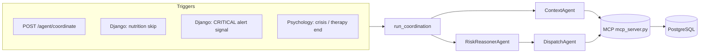

# Glunova Care Coordination Agent — Architecture

This document describes the **care coordination agent** that lives under `backend/fastapi_ai/agent/`. It is a multi-step pipeline: gather patient context via MCP tools, reason with an LLM, then dispatch messages to the patient, doctor, and caregivers via PostgreSQL.

---

## 1. Purpose

The agent **proactively coordinates care** by:

1. Loading **allowed** patient context (nutrition / weekly activity adherence, psychology, care team).
2. Producing **role-specific draft messages** (patient nudge, caregiver update, doctor summary) keyed off a **trigger** (meal skip, therapy end, crisis, etc.).
3. **Persisting** those messages as **Monitoring health alerts** (patient + doctor) and **Care Circle family updates** (each linked caregiver).

It does **not** consume formal **screening outputs** or **risk-assessment** feeds as model input (those MCP tools were removed from the context path). The output field name `risk_tier` in JSON is **coordination urgency** inferred from the allowed context only, not a clinical stratification score from the monitoring fusion engine.

---

## 2. High-level layout

| Piece | Role |
|--------|------|
| **FastAPI** (`agent/router.py`) | HTTP entry: `POST /agent/coordinate`, `POST /agent/coordinate/all` |
| **Orchestrator** (`orchestrator.py`) | Single end-to-end run: MCP session → Context → Risk reasoner → Dispatch |
| **MCP server** (`mcp_server.py`, stdio subprocess) | DB-backed tools: `get_nutrition_summary`, `get_psychology_state`, `get_care_team`, `dispatch_update` |
| **ContextAgent** | Calls read-tools in parallel → `PatientContext` |
| **RiskReasonerAgent** | Groq chat completion (JSON) → `ReasoningOutput` |
| **DispatchAgent** | Groq + tool calls → `dispatch_update` per recipient (with deduplication) |

The orchestrator opens **one MCP client session** (stdio) for the whole run. Context and dispatch share that session so `dispatch_update` runs on the same MCP connection.

---

## 3. End-to-end sequence

**Ordered steps inside `run_coordination`:**

1. **Start MCP** — `stdio_client` + `ClientSession` to `mcp_server.py` (Python subprocess).
2. **ContextAgent** — parallel `call_tool` for `get_nutrition_summary`, `get_psychology_state`, `get_care_team` → build `PatientContext`.
3. **Cooldown guard** — may **return early** without calling the reasoner (see §6).
4. **RiskReasonerAgent** — `risk_reasoner_agent.run(ctx, trigger)` → `ReasoningOutput`.
5. **Optional no-dispatch exit** — if `should_dispatch` is false and trigger is not force-dispatched, return without dispatch (see §6).
6. **DispatchAgent** — `dispatch_agent.run(reasoning, care_team, session)` → MCP `dispatch_update` tool calls.
7. **Close MCP session** when the `async with` blocks exit.

---

## 4. HTTP API (FastAPI)

Mounted in `main.py` with prefix **`/agent`**:

| Method | Path | Body | Purpose |
|--------|------|------|---------|
| `POST` | `/agent/coordinate` | `CoordinateRequest`: `patient_id`, `trigger` | Run for one patient |
| `POST` | `/agent/coordinate/all` | `CoordinateAllRequest`: `trigger` (`cron` \| `manual`) | Batch: distinct `patient_id` from **active** `monitoring_healthalert` rows in the **last 24 hours** |

**Triggers** (`CoordinateRequest.trigger`):

| Value | Typical meaning |
|--------|------------------|
| `nutrition_skip` | Patient marked a meal or exercise session skipped (wellness planner) |
| `therapy_session` | Therapy session ended; post-session summaries (when enabled from psychology service) |
| `crisis` | Psychology crisis event persisted |
| `alert` | Often tied to new **CRITICAL** monitoring alert (Django signal) |
| `cron` / `manual` | Scheduled or explicit runs |
| `alert` / `cron` / `manual` | Subject to **cooldown** unless bypassed (§6) |

---

## 5. Data contracts (`schemas.py`)

- **`PatientContext`** — `patient_id`, `nutrition` (dict), `psychology` (dict), `care_team` (dict).  
  No monitoring/screening/risk-assessment payloads in this object.

- **`ReasoningOutput`** — `risk_tier`, `priority_level`, `key_signals`, `should_dispatch`, `patient_nudge`, `caregiver_update`, `doctor_summary`.

- **`CoordinateResponse`** — `status`, `messages_dispatched`, `trigger`, optional `risk_tier`, `skipped_reason` when skipped or no dispatch.

---

## 6. Cooldown and “force dispatch”

Implemented in `orchestrator.py`.

**Cooldown applies only when:**

- `open_crisis == 0` (from `get_psychology_state`), **and**
- `trigger` is **not** in `{"nutrition_skip", "crisis", "therapy_session"}`.

Then `_is_cooled_down` checks the **latest wellness plan** snapshot for **`last_agent_run`** (written when `dispatch_update` succeeds). If the last run was **< 30 minutes** ago, the orchestrator **returns immediately** with `status="skipped"` — **RiskReasonerAgent is not invoked**.

**Triggers that never hit the cooldown gate:** `nutrition_skip`, `crisis`, `therapy_session`.

**Open crisis:** If `open_crisis > 0`, the cooldown block is skipped for **any** trigger.

**Force dispatch:** If `trigger` ∈ `{"manual", "nutrition_skip", "crisis", "therapy_session"}`, the pipeline **continues to DispatchAgent** even when `should_dispatch` is false in `ReasoningOutput`. Otherwise, `should_dispatch` false causes an early return with `messages_dispatched=0` (“signals within normal range”).

---

## 7. MCP tools (`mcp_server.py`)

The MCP process uses **psycopg** and the same **`database_url`** as FastAPI (`core.config.settings`).

### Read tools (ContextAgent)

| Tool | Returns (conceptually) |
|------|-------------------------|
| **`get_nutrition_summary`** | Latest weekly wellness plan slice, skipped exercise session count (7d), nutrition goal targets. May include `last_agent_run` from JSON merge on the plan row. |
| **`get_psychology_state`** | Latest emotion assessment row, therapy session count (7d), count of **unacknowledged** crisis events, and **`last_completed_session`** (latest ended session: ids, times, structured `session_summary_json`, size-capped). |
| **`get_care_team`** | Linked doctor (patient–doctor link) and **accepted** caregivers (document links). |

### Write tool (DispatchAgent)

| Tool | Behavior |
|------|----------|
| **`dispatch_update`** | **`caregiver`** → `INSERT` into `carecircle_familyupdate` (`source='agent'`). **`patient`** / **`doctor`** → `INSERT` into `monitoring_healthalert` with `agent_audience` set. Then **merges** `last_agent_run` into `nutrition_weeklywellnessplan.clinical_snapshot` for cooldown/audit. |

---

## 8. RiskReasonerAgent (`agents/risk_reasoner_agent.py`)

- **Provider:** Groq (`settings.groq_api_key`).
- **Default model:** `settings.groq_model` (e.g. `llama-3.3-70b-versatile`).
- **Output:** JSON object parsed into `ReasoningOutput`.

The **user prompt** includes:

- A **trigger-specific block** (`_TRIGGER_FOCUS`): instructions per `nutrition_skip`, `alert`, `cron`, `crisis`, `therapy_session`, etc.
- `NUTRITION_AND_ACTIVITY` and `PSYCHOLOGY` JSON dumps.
- Care-team presence flags.

The **system prompt** restricts scope to nutrition/activity + psychology and forbids inventing screening or risk-stratification data.

---

## 9. DispatchAgent (`agents/dispatch_agent.py`)

- **Provider:** Groq.
- **Model:** `settings.psychology_consolidation_model` (e.g. `llama-3.1-8b-instant`).
- **Mechanism:** Chat completions with a single **function tool** `dispatch_update`. The model must call it for each recipient (patient, each caregiver by id, doctor).

**Deduplication:** If the model emits **duplicate** tool calls for the same logical recipient `(recipient_type, recipient_id)` in one run, later duplicates are skipped (no second DB insert); the tool still receives a success-shaped response so the chat loop stays valid.

**Titles:** System text hints titles by context (e.g. “Therapy Session Summary”, “Meal Check-in”, “Crisis Support Alert”).

---

## 10. External callers (outside FastAPI route)

These **POST** to the FastAPI agent URL (often via `AI_SERVICE_URL` / `settings` in Django):

| Source | Trigger | Notes |
|--------|---------|--------|
| `django_app/nutrition/views.py` | `nutrition_skip` | After PATCH sets meal/exercise status to `skipped` (only on transition to skipped). Daemon thread + `httpx`. |
| `django_app/monitoring/signals.py` | `alert` | On **new** `HealthAlert` with `severity == CRITICAL`. |
| `psychology/repositories.py` | `crisis` | After `PsqlCrisisStore.add` inserts a crisis event: thread + `asyncio.run(run_coordination(...))`. |
| `psychology/repositories.py` + `psychology/service.py` | `therapy_session` | After therapy session is persisted to Postgres on end-session (spawn thread). |

**Batch / cron:**

- `django_app/monitoring/management/commands/run_coordination_agent.py` calls **`POST …/agent/coordinate/all`** (intended for cron). The request body’s `trigger` should match `CoordinateAllRequest` (`cron` or `manual`).

---

## 11. Configuration (environment)

Relevant FastAPI / agent settings (see `core/config.py`):

- **`GROQ_API_KEY`** — required for RiskReasoner and Dispatch agents.
- **`database_url`** — MCP tools and `/coordinate/all` patient discovery.
- **`AI_SERVICE_URL`** — used by Django to reach FastAPI (default often `http://127.0.0.1:8001`).

---

## 12. File map

| Path | Responsibility |
|------|----------------|
| `agent/orchestrator.py` | Coordination loop, cooldown, wiring |
| `agent/router.py` | REST endpoints |
| `agent/schemas.py` | Pydantic request/response and inter-agent models |
| `agent/mcp_server.py` | MCP stdio server: tools + DB writes |
| `agent/agents/context_agent.py` | Parallel MCP reads → `PatientContext` |
| `agent/agents/risk_reasoner_agent.py` | Groq JSON reasoning |
| `agent/agents/dispatch_agent.py` | Groq tool loop → `dispatch_update` |

---

## 13. Operational notes

- **Two LLM calls per successful full run:** RiskReasoner + Dispatch (plus MCP subprocess startup cost).
- **MCP is local stdio:** no network hop for tools; Postgres is accessed from inside the MCP process.
- **Caregiver duplicates:** prevented in DispatchAgent per run; repeated HTTP triggers (e.g. double API calls) need separate app-level guards (e.g. idempotent PATCH handlers).

For wider backend split (Django vs FastAPI), see `backend/ARCHITECTURE.md` at the repo level.
