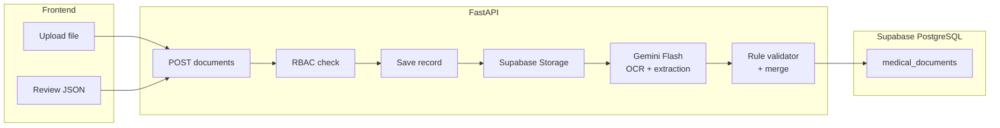

# Documents OCR and Understanding System (Care Circle) — v2

## Context

- Care Circle UI is currently static mock data in `frontend/app/dashboard/care-circle/page.tsx`; there is **no** document API or storage in the backend yet.
- `backend/requirements.txt` already includes `python-multipart` for file uploads.
- **No system-level OCR dependencies are needed** — Gemini Flash handles both OCR and structured extraction via API.

## Target behavior

- **Users run OCR after deploy** via your app: upload image or PDF from Care Circle; backend returns **raw OCR text** + **structured JSON** aligned with your schema (patient block, clinical measurements, prescription `medications[]`, metadata including `document_type` heuristics).
- **Gemini Flash (Google AI Studio):** free tier, 1,500 requests/day, no credit card required. Handles images and PDFs natively in a single API call. Replaces Tesseract + separate LLM refinement.
- **Rule pass (deterministic):** runs on the raw text Gemini returns; acts as a **validation and grounding layer** rather than primary extractor. Regex patterns for BP, labs, dates, medications. Missing fields → `null` / `[]`.
- **Conservative merge:** rule-validated values take precedence over Gemini-only values for numeric clinical fields; Gemini values accepted for text fields only when grounded in OCR substring.

**Pipeline:** `Ingest → Supabase Storage → Gemini Flash (OCR + extraction) → rule validation → merge → persist to Supabase DB`.

**Safeguards:** Pydantic/schema validation on output; **conservative merge** — Gemini output may only **add or clarify** fields that can be **grounded in the OCR substring** (prompt instructs "quote evidence spans"; post-check that string values are substrings of `raw_ocr_text` or normalized variants; else discard Gemini value and keep rule/null); never trust Gemini for numeric clinical values unless substring matches OCR.

**Degraded behavior:** if Gemini call fails or `GEMINI_API_KEY` is missing, log error and set `llm_refinement_status=skipped|failed` — do not block upload. Rule-only `extracted_json` is persisted as fallback.



---

## Backend design

### 1. Data model

New SQLAlchemy model `MedicalDocument` in `backend/app/models/` with:

- `id` (UUID), `patient_id` (FK patients), `uploaded_by_user_id` (FK users)
- `original_filename`, `mime_type`
- `storage_path` — Supabase Storage object path (e.g. `documents/{patient_id}/{doc_id}/filename.pdf`)
- `raw_ocr_text` (text) — raw text returned by Gemini for audit
- `extracted_json` (JSONB) — **final merged** output
- `extracted_json_rules` (JSONB) — rule-only pass snapshot for audit/debug
- `llm_provider_used` (nullable string) — always `gemini-2.0-flash` when used
- `llm_refinement_status` (`ok` / `skipped` / `failed`)
- `document_type_detected` (string)
- `processing_status` (`pending` / `completed` / `failed`)
- `error_message` (nullable), timestamps

Alembic: new revision `0002_medical_documents.py` following the pattern in `backend/alembic/versions/20260413_0001_initial_schema.py`.

### 2. File storage — Supabase Storage

- On upload, stream file bytes to Supabase Storage bucket (e.g. `medical-documents`) under path `{patient_id}/{doc_id}/{original_filename}`.
- Store the object path in `storage_path` column — never store the signed URL (generate on-demand for access).
- Use `supabase-py` client: `supabase.storage.from_("medical-documents").upload(path, file_bytes)`.
- For retrieval, generate a **short-lived signed URL** (e.g. 60 seconds) per request rather than storing public URLs.
- Bucket should be **private** (not public) — access only via signed URLs generated server-side after RBAC check.
- Add env `SUPABASE_STORAGE_BUCKET` (default `medical-documents`).

```python
# Upload
res = supabase.storage.from_(settings.SUPABASE_STORAGE_BUCKET).upload(
    path=f"{patient_id}/{doc_id}/{filename}",
    file=file_bytes,
    file_options={"content-type": mime_type}
)

# Signed URL for download
url = supabase.storage.from_(settings.SUPABASE_STORAGE_BUCKET).create_signed_url(
    path=storage_path, expires_in=60
)
```

### 3. OCR + extraction service — Gemini Flash

New package `backend/app/services/document_ocr/`:

**`ingest_file`**: validate MIME (`image/jpeg`, `image/png`, `application/pdf`), size limit (env-configurable, default 10MB). Upload to Supabase Storage.

**`run_gemini_ocr`**: send file to Gemini Flash with a structured extraction prompt. Gemini handles PDFs natively — no pdf2image or rasterization needed. For images, send as base64. Returns both `raw_ocr_text` and a candidate `extracted_json`.

```python
import google.generativeai as genai

genai.configure(api_key=settings.GEMINI_API_KEY)
model = genai.GenerativeModel("gemini-2.0-flash")

response = model.generate_content([
    {"mime_type": mime_type, "data": file_bytes_b64},
    OCR_EXTRACTION_PROMPT  # see prompt design below
])
```

**Prompt design** — instruct Gemini to:
1. Return the full raw OCR text verbatim in a `raw_text` field.
2. Extract structured fields into a `extracted` object matching your schema.
3. For every extracted string value, include an `evidence` field quoting the exact substring from `raw_text` that supports it.
4. Return **only JSON**, no markdown fences, no preamble.

```python
OCR_EXTRACTION_PROMPT = """
You are a medical document OCR and extraction system.

1. Read the document image/PDF and return the complete raw text verbatim in raw_text.
2. Extract structured fields into extracted matching this schema:
   {
     "patient": { "name": str|null, "dob": "YYYY-MM-DD"|null, "id": str|null },
     "document_type": "prescription"|"lab_report"|"medical_report"|"unknown",
     "date": "YYYY-MM-DD"|null,
     "vitals": { "blood_pressure": str|null, "heart_rate": str|null },
     "labs": [{ "name": str, "value": str, "unit": str|null }],
     "medications": [{ "name": str, "dosage": str|null, "frequency": str|null, "duration": str|null, "route": str|null }],
     "notes": str|null
   }
3. For every non-null string value in extracted, add an evidence field with the exact substring from raw_text.
4. Return ONLY valid JSON, no markdown, no explanation.
"""
```

**`normalize_ocr_text`**: light cleanup on Gemini's returned `raw_text` (merge broken lines, whitelist-only token fixes).

**`run_rule_validation`** (`extraction_rules.py`): runs on `raw_ocr_text`; now acts as a **validator** rather than primary extractor:
- Dates: regex + `dateutil` → ISO `YYYY-MM-DD` or `null`.
- BP: `\b(\d{2,3})\s*/\s*(\d{2,3})\b`.
- Labs: patterns for glucose, HbA1c, cholesterol, insulin with unit capture.
- Medications: line-oriented heuristics for `Rx`, drug name + dose + frequency.
- `document_type`: priority rules as fallback if Gemini's is `unknown`.

**`merge_and_validate`**: conservative merge logic:
- For **numeric clinical values** (BP, lab values): always prefer rule-extracted value; discard Gemini value unless it matches OCR substring.
- For **text fields** (patient name, medication names, notes): prefer Gemini value if `evidence` substring is found in `raw_ocr_text`; else keep rule value or `null`.
- Final output validated with shared Pydantic model.

### 4. API (RBAC)

New router `backend/app/api/v1/documents.py` mounted under `/api/v1` with prefix `/documents`.

Use existing access patterns from `backend/app/services/access.py`:
- **Patient**: upload and list **own** documents (`patient_id == current_user.id`).
- **Doctor**: upload/list for **assigned** patients.
- **Caregiver**: upload on behalf of linked patient + read-only list and view extraction (no raw OCR text exposed to caregivers).

Endpoints:
- `POST /documents` — `multipart/form-data`: `file`, `patient_id`; triggers full pipeline; returns document metadata + `extracted_json`.
- `GET /documents` — paginated, filtered by `patient_id` (enforced by role).
- `GET /documents/{id}` — detail including `raw_ocr_text` (patients and doctors only) and `extracted_json`.
- `GET /documents/{id}/download` — generates short-lived Supabase signed URL, returns redirect.

### 5. Dependencies and Docker

**Remove** from `backend/Dockerfile`:
```dockerfile
# NO LONGER NEEDED — delete these lines
RUN apt-get install -y tesseract-ocr tesseract-ocr-eng poppler-utils
```

**Remove** from `backend/requirements.txt`:
```
# NO LONGER NEEDED
pytesseract
pdf2image
```

**Add** to `backend/requirements.txt`:
```
google-generativeai
supabase
Pillow          # still useful for image validation/normalization
python-dateutil
```

Docker image is now **significantly lighter** and runs comfortably on **512MB RAM** — compatible with free-tier hosts (Render, Koyeb).

### 6. Configuration

Add to `backend/app/core/config.py`:

```python
# File upload
UPLOAD_MAX_MB: int = 10
SUPABASE_STORAGE_BUCKET: str = "medical-documents"

# Gemini (Google AI Studio — free, no credit card)
GEMINI_API_KEY: str           # from aistudio.google.com
GEMINI_MODEL: str = "gemini-2.0-flash"
LLM_TIMEOUT_SECONDS: int = 30
LLM_MAX_CHARS: int = 50000    # truncate tail if needed
```

Update `backend/.env.example`:
```env
# Supabase
SUPABASE_URL=https://your-project.supabase.co
SUPABASE_SERVICE_KEY=your-service-role-key
SUPABASE_STORAGE_BUCKET=medical-documents

# Gemini OCR (free — get key at aistudio.google.com, no credit card needed)
# Free tier: 1500 requests/day
# PHI note: Google AI Studio is NOT HIPAA BAA covered — for production with real
# patient data, switch to Gemini via Google Cloud (BAA available) or self-hosted model.
GEMINI_API_KEY=
GEMINI_MODEL=gemini-2.0-flash
LLM_TIMEOUT_SECONDS=30

# Upload limits
UPLOAD_MAX_MB=10
```

---

## Frontend design

No changes from v1. Add a **"Medical documents"** section on `frontend/app/dashboard/care-circle/page.tsx`:

- File input + upload to `POST /api/v1/documents` with Bearer token.
- Show **processing state**, then render extracted fields (tables for labs, list for medications) with "values from OCR — verify with clinician" disclaimer.
- List recent uploads from `GET /documents`.
- Download button calls `GET /documents/{id}/download` → signed URL redirect.

---

## Deployment checklist

| Item | Solution |
|---|---|
| Database | Supabase free tier (watch: auto-pauses after 7 days inactivity) |
| File storage | Supabase Storage, private bucket, signed URLs |
| OCR + extraction | Gemini Flash via AI Studio (free, 1500 req/day) |
| Backend hosting | Any host with ≥512MB RAM (Render, Koyeb, Railway, Fly.io) |
| Team local dev | `docker-compose up` — no system binaries to install |
| API key setup | Each teammate needs a Google account → aistudio.google.com |

**Supabase free tier pausing:** log into the Supabase dashboard at least once a week during development to prevent auto-pause, or upgrade to Pro ($25/month) before going live with real users.

---

## Security and compliance (v1)

- **PHI warning:** Google AI Studio free tier is **not HIPAA BAA covered**. Acceptable for development and demo. For production with real patient data, switch to Gemini via **Google Cloud Platform** (BAA available) or a self-hosted open-source vision model (e.g. LLaVA via Ollama).
- Supabase Storage bucket must be **private** — never public.
- Generate signed URLs server-side, after RBAC check, with short expiry (60 seconds).
- Store `uploaded_by_user_id` and timestamps; log document id + user id on access.
- Content-type + extension validation + size limits on upload.

---

## Testing

- **Unit tests**: rule validator fixtures with sample medical text.
- **Gemini mock tests**: mock `google.generativeai` HTTP responses covering merge logic, substring grounding rejection, and `skipped`/`failed` fallback paths. No real Gemini calls in CI.
- **Supabase Storage mock**: mock `supabase-py` upload/signed-URL calls.
- **Integration test** (optional): real Gemini call with a sanitized (non-PHI) sample document.

---

## Implementation order

1. Model + Alembic `0002` + config + Supabase Storage helper.
2. Gemini Flash OCR service + rule validator + merge/validate + persist (final + rule snapshots).
3. `POST/GET` documents API + RBAC.
4. Care Circle UI upload + results display.
5. README: docker-compose setup, how to get Gemini API key, Supabase Storage bucket setup, PHI compliance note.
