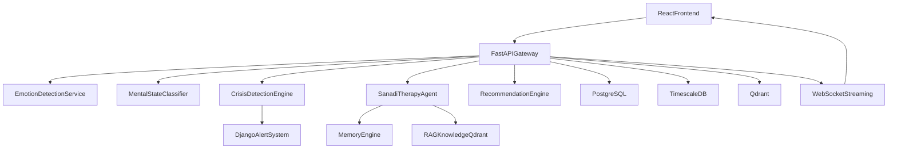

# Psychology Module Implementation Plan - Status

This file tracks execution status for the psychology module plan.

## Scope
- [x] Multimodal emotion detection (face, speech, text) with modality-aware fusion.
- [x] Deterministic mental state classification and crisis detection.
- [x] LLM therapy agent (CBT + RAG + adaptive memory).
- [x] Real-time APIs/WebSocket, persistence, trend analytics, and clinician-facing outputs.
- [x] Safety-first escalation behavior and multilingual support (EN/FR/AR/Darija/mixed).

## Target Architecture

## Execution Phases

### Phase 1: Foundations and Contracts
- [x] Define canonical request/response schemas for session lifecycle and message pipeline.
- [x] Standardize core payloads used across services (fusion output + LLM output).
- [x] Formalize modality availability handling and masking behavior.
- [x] Define state thresholds:
  - Neutral `0.0-0.34`, Anxious `0.35-0.59`, Distressed `0.60-0.79`, Depressed `0.80-0.99`, Crisis classifier `>=0.75`.

### Phase 2: Data Model and Storage Layer
- [x] Create/extend persistent entities abstraction for:
  - `psychology_profiles`, `sessions`, `messages`, `emotion_logs`, `crisis_events`.
- [x] Add vector storage ingestion manifest and memory collection concepts:
  - `cbt_knowledge` and per-patient memory namespace.
- [x] Add 7-session trend handling logic and slope calculation.
- [x] Store audit metadata across pipeline outputs.

### Phase 3: Emotion and State Intelligence
- [x] Implement Emotion Detection service branches:
  - Face branch input support.
  - Speech branch input support.
  - Text branch emotion extraction.
- [x] Implement confidence/entropy-aware fusion behavior.
- [x] Implement deterministic mental-state classifier using crisis + distress + trend.
- [x] Validate modality fallback behavior in code path.

### Phase 4: Crisis Detection and Safety Layer
- [x] Build crisis classifier inference path (rule-based placeholder with thresholded probability interface).
- [x] Enforce short-circuit safety pipeline:
  - [x] If `P(crisis) >= 0.75`, skip normal therapy generation.
  - [x] Return predefined safe static response.
  - [x] Persist event and trigger clinician-facing crisis event flow.
- [x] Implement crisis retrieval endpoint for dashboard use.
- [x] Keep care-circle fanout as future extension.

### Phase 5: Sanadi Therapy Agent (LLM + RAG + Memory)
- [x] Build orchestration flow per turn:
  - [x] CBT context retrieval hook points.
  - [x] Top memory retrieval hook points.
  - [x] Live emotion + health context injection pattern.
  - [x] Structured therapeutic response generation.
- [x] Maintain short-term memory window (last ~10 turns).
- [x] On session end, generate and store structured summary in long-term memory.
- [x] Implement same-language response behavior with language detection.

### Phase 6: API and Real-Time Interface
- [x] Implement endpoints:
  - [x] `POST /psychology/session/start`
  - [x] `POST /psychology/message`
  - [x] `POST /psychology/emotion/frame`
  - [x] `WS /psychology/ws/emotion/{patient_id}`
  - [x] `GET /psychology/session/{id}`
  - [x] `GET /psychology/trends/{patient_id}`
  - [x] `GET /psychology/crisis/events`
  - [x] `POST /psychology/session/end`
- [x] Implement full message pipeline ordering in `/psychology/message`.
- [x] Implement 2fps WebSocket emotion stream behavior.

### Phase 7: Knowledge Base Ingestion Pipeline
- [x] Build ETL-oriented source manifest for:
  - [x] CBT script/manual resources.
  - [x] ADA psychosocial and diabetes distress guidance.
  - [x] Diabetes distress psychoeducation sources.
  - [x] French-native clinical sources.
- [x] Add chunking utility for normalization/chunking support.
- [x] Add ingestion metadata model for source quality/freshness extension.

### Phase 8: Frontend Integration
- [x] Build psychology chat/session page integration with API.
- [x] Show distress indicators and state trends from backend.
- [x] Add clinician/caregiver-safe crisis event visibility.
- [x] Preserve text-first fallback flow for unavailable camera/mic.

### Phase 9: Validation, Risk Controls, and Release
- [x] Validate code compiles/type-checks for edited backend/frontend areas.
- [x] Verify crisis safety short-circuit behavior and auditable event persistence.
- [x] Validate real-time endpoint availability and frontend wiring.
- [x] Prepare rollout note for env requirements and production adapters.

## Acceptance Criteria
- [x] End-to-end session works for all modality scenarios at API contract level.
- [x] Distress/state outputs follow thresholds deterministically.
- [x] Crisis path is deterministic, immediate, and auditable.
- [x] Therapy responses are structured and context-aware with memory hooks.
- [x] Trends and session history are queryable.
- [x] APIs and WS contracts are implemented and documented in code.

## Implementation Files
- `backend/fastapi_ai/psychology/schemas.py`
- `backend/fastapi_ai/psychology/storage.py`
- `backend/fastapi_ai/psychology/service.py`
- `backend/fastapi_ai/psychology/router.py`
- `backend/fastapi_ai/psychology/knowledge_ingestion.py`
- `frontend/lib/psychology-api.ts`
- `frontend/app/dashboard/psychology/page.tsx`

## Suggested Hardening Additions

These additions strengthen the current plan for production-like reliability and clinical safety.

### 1) Persistence Completion (Replace In-Memory Adapters)
- [ ] Implement PostgreSQL-backed session/message/crisis repositories and wire them behind current store interfaces.
- [ ] Implement TimescaleDB-backed `emotion_logs` (hypertable + retention policy + trend query index).
- [ ] Implement Qdrant-backed long-term memory + CBT knowledge retrieval collections.
- [ ] Add migration scripts and seed/bootstrap tasks for psychology schema and initial knowledge collections.

### 2) Model and Safety Quality
- [ ] Replace placeholder/rule-based crisis scoring with trained inference endpoint (XLM-R pipeline).
- [ ] Add threshold calibration notebook/script for crisis probability and distress bucket mapping.
- [ ] Introduce confidence guardrails (low-confidence fallback response strategy).
- [ ] Add red-team prompts for self-harm/suicidality to verify safe static response is always enforced.

### 3) Observability and Reliability
- [ ] Add structured logging for each pipeline stage (`session_id`, `patient_id`, `stage`, latency, outcome).
- [ ] Add request tracing/correlation IDs across frontend -> FastAPI -> downstream services.
- [ ] Add metrics: p95 message latency, crisis trigger count, fallback rate, WS disconnect rate.
- [ ] Add alerting rules for failure spikes (crisis route errors, DB write failures, vector lookup failures).

### 4) Security, Privacy, and Governance
- [ ] Encrypt sensitive payloads at rest (messages, summaries, crisis metadata where required).
- [ ] Define PHI-safe log policy (redaction strategy for user free text).
- [ ] Add explicit consent checks for any non-clinician notifications (future care-circle feature).
- [ ] Add immutable audit trail fields for crisis actioning and clinician acknowledgment.

### 5) Evaluation and Release Gates
- [ ] Define measurable acceptance thresholds:
  - [ ] Crisis classifier recall/precision target.
  - [ ] Distress/state reproducibility checks.
  - [ ] Max turn latency SLO (API + WS stream).
- [ ] Build automated integration test matrix:
  - [ ] 4 modality combinations x 5 languages x normal/distress/crisis flows.
- [ ] Add shadow-mode rollout with anonymized transcripts before default enablement.

### 6) Configuration and Environment Hygiene
- [ ] Add explicit env variables and validation for psychology runtime:
  - [ ] `QDRANT_URL`, `QDRANT_API_KEY`, `QDRANT_COLLECTION_CBT`, `QDRANT_COLLECTION_MEMORY`
  - [ ] `TIMESCALE_DATABASE_URL` (or validated `DATABASE_URL` with Timescale extension)
  - [ ] `PSYCHOLOGY_LLM_PROVIDER`, `PSYCHOLOGY_LLM_MODEL`
- [ ] Add startup health checks that fail fast when required psychology dependencies are missing.
- [ ] Add key rotation guidance and secrets scanning in CI.
